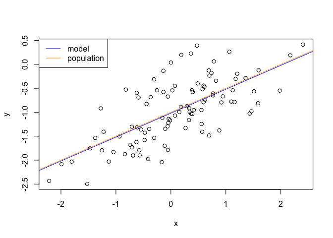

# Chapter 3


```r
library(MASS)
library(ISLR)
```

##Linear Regression

Simple linear regression of median value onto lstat

```r
lstat.lm <- lm(medv ~ lstat, data = Boston)
lstat.lm
```

```
## 
## Call:
## lm(formula = medv ~ lstat, data = Boston)
## 
## Coefficients:
## (Intercept)        lstat  
##       34.55        -0.95
```

```r
summary(lstat.lm)
```

```
## 
## Call:
## lm(formula = medv ~ lstat, data = Boston)
## 
## Residuals:
##     Min      1Q  Median      3Q     Max 
## -15.168  -3.990  -1.318   2.034  24.500 
## 
## Coefficients:
##             Estimate Std. Error t value Pr(>|t|)    
## (Intercept) 34.55384    0.56263   61.41   <2e-16 ***
## lstat       -0.95005    0.03873  -24.53   <2e-16 ***
## ---
## Signif. codes:  0 '***' 0.001 '**' 0.01 '*' 0.05 '.' 0.1 ' ' 1
## 
## Residual standard error: 6.216 on 504 degrees of freedom
## Multiple R-squared:  0.5441,	Adjusted R-squared:  0.5432 
## F-statistic: 601.6 on 1 and 504 DF,  p-value: < 2.2e-16
```

Can make confidence intervals

```r
confint(lstat.lm)
```

```
##                 2.5 %     97.5 %
## (Intercept) 33.448457 35.6592247
## lstat       -1.026148 -0.8739505
```

Can use predict to estimate values based on the model, gives confidence intervals.

```r
predict(lstat.lm, data.frame(lstat = c(5,10,15)), interval = "confidence")
```

```
##        fit      lwr      upr
## 1 29.80359 29.00741 30.59978
## 2 25.05335 24.47413 25.63256
## 3 20.30310 19.73159 20.87461
```

Can also do prediction intervals

```r
predict(lstat.lm, data.frame(lstat = c(5,10,15)), interval = "prediction")
```

```
##        fit       lwr      upr
## 1 29.80359 17.565675 42.04151
## 2 25.05335 12.827626 37.27907
## 3 20.30310  8.077742 32.52846
```


Plot the data and the regression:

```r
attach(Boston)
plot(lstat, medv)
abline(lstat.lm)
```

<!-- -->

Use plot to look at quality of the fit:

```r
par(mfrow=c(2,2))
plot(lstat.lm)
```

<!-- -->

Can graph residuals manually:

```r
par(mfrow=c(2,1))
plot(predict(lstat.lm), residuals(lstat.lm))
plot(predict(lstat.lm), rstudent(lstat.lm))
```

<!-- -->


Look for points with high leverage:

```r
par(mfrow=c(1,1))
plot(hatvalues(lstat.lm))
```

<!-- -->

```r
which.max(hatvalues(lstat.lm))
```

```
## 375 
## 375
```

##Multiple linear regression

```r
lstat.age.lm <- lm(medv ~ lstat + age, data = Boston)
summary(lstat.age.lm)
```

```
## 
## Call:
## lm(formula = medv ~ lstat + age, data = Boston)
## 
## Residuals:
##     Min      1Q  Median      3Q     Max 
## -15.981  -3.978  -1.283   1.968  23.158 
## 
## Coefficients:
##             Estimate Std. Error t value Pr(>|t|)    
## (Intercept) 33.22276    0.73085  45.458  < 2e-16 ***
## lstat       -1.03207    0.04819 -21.416  < 2e-16 ***
## age          0.03454    0.01223   2.826  0.00491 ** 
## ---
## Signif. codes:  0 '***' 0.001 '**' 0.01 '*' 0.05 '.' 0.1 ' ' 1
## 
## Residual standard error: 6.173 on 503 degrees of freedom
## Multiple R-squared:  0.5513,	Adjusted R-squared:  0.5495 
## F-statistic:   309 on 2 and 503 DF,  p-value: < 2.2e-16
```


```r
boston.all.lm <- lm(medv ~., data = Boston)
summary(boston.all.lm)
```

```
## 
## Call:
## lm(formula = medv ~ ., data = Boston)
## 
## Residuals:
##     Min      1Q  Median      3Q     Max 
## -15.595  -2.730  -0.518   1.777  26.199 
## 
## Coefficients:
##               Estimate Std. Error t value Pr(>|t|)    
## (Intercept)  3.646e+01  5.103e+00   7.144 3.28e-12 ***
## crim        -1.080e-01  3.286e-02  -3.287 0.001087 ** 
## zn           4.642e-02  1.373e-02   3.382 0.000778 ***
## indus        2.056e-02  6.150e-02   0.334 0.738288    
## chas         2.687e+00  8.616e-01   3.118 0.001925 ** 
## nox         -1.777e+01  3.820e+00  -4.651 4.25e-06 ***
## rm           3.810e+00  4.179e-01   9.116  < 2e-16 ***
## age          6.922e-04  1.321e-02   0.052 0.958229    
## dis         -1.476e+00  1.995e-01  -7.398 6.01e-13 ***
## rad          3.060e-01  6.635e-02   4.613 5.07e-06 ***
## tax         -1.233e-02  3.760e-03  -3.280 0.001112 ** 
## ptratio     -9.527e-01  1.308e-01  -7.283 1.31e-12 ***
## black        9.312e-03  2.686e-03   3.467 0.000573 ***
## lstat       -5.248e-01  5.072e-02 -10.347  < 2e-16 ***
## ---
## Signif. codes:  0 '***' 0.001 '**' 0.01 '*' 0.05 '.' 0.1 ' ' 1
## 
## Residual standard error: 4.745 on 492 degrees of freedom
## Multiple R-squared:  0.7406,	Adjusted R-squared:  0.7338 
## F-statistic: 108.1 on 13 and 492 DF,  p-value: < 2.2e-16
```


```r
library(car)
vif(boston.all.lm)
```

```
##     crim       zn    indus     chas      nox       rm      age      dis 
## 1.792192 2.298758 3.991596 1.073995 4.393720 1.933744 3.100826 3.955945 
##      rad      tax  ptratio    black    lstat 
## 7.484496 9.008554 1.799084 1.348521 2.941491
```


```r
boston.all.lm <- lm(medv ~. -age - indus ,data=Boston )
summary(boston.all.lm)
```

```
## 
## Call:
## lm(formula = medv ~ . - age - indus, data = Boston)
## 
## Residuals:
##      Min       1Q   Median       3Q      Max 
## -15.5984  -2.7386  -0.5046   1.7273  26.2373 
## 
## Coefficients:
##               Estimate Std. Error t value Pr(>|t|)    
## (Intercept)  36.341145   5.067492   7.171 2.73e-12 ***
## crim         -0.108413   0.032779  -3.307 0.001010 ** 
## zn            0.045845   0.013523   3.390 0.000754 ***
## chas          2.718716   0.854240   3.183 0.001551 ** 
## nox         -17.376023   3.535243  -4.915 1.21e-06 ***
## rm            3.801579   0.406316   9.356  < 2e-16 ***
## dis          -1.492711   0.185731  -8.037 6.84e-15 ***
## rad           0.299608   0.063402   4.726 3.00e-06 ***
## tax          -0.011778   0.003372  -3.493 0.000521 ***
## ptratio      -0.946525   0.129066  -7.334 9.24e-13 ***
## black         0.009291   0.002674   3.475 0.000557 ***
## lstat        -0.522553   0.047424 -11.019  < 2e-16 ***
## ---
## Signif. codes:  0 '***' 0.001 '**' 0.01 '*' 0.05 '.' 0.1 ' ' 1
## 
## Residual standard error: 4.736 on 494 degrees of freedom
## Multiple R-squared:  0.7406,	Adjusted R-squared:  0.7348 
## F-statistic: 128.2 on 11 and 494 DF,  p-value: < 2.2e-16
```

Adding * between terms will prompt lm to include both the single and interaction terms


```r
boston.interaction <- lm(medv ~ crim*black*lstat, data = Boston)
summary(boston.interaction)
```

```
## 
## Call:
## lm(formula = medv ~ crim * black * lstat, data = Boston)
## 
## Residuals:
##     Min      1Q  Median      3Q     Max 
## -15.724  -3.953  -1.177   1.948  25.645 
## 
## Coefficients:
##                    Estimate Std. Error t value Pr(>|t|)    
## (Intercept)       2.102e+01  5.741e+00   3.660 0.000279 ***
## crim             -1.409e-01  2.200e-01  -0.641 0.521966    
## black             3.592e-02  1.491e-02   2.409 0.016378 *  
## lstat            -3.543e-01  2.910e-01  -1.218 0.223964    
## crim:black       -6.675e-05  7.053e-04  -0.095 0.924638    
## crim:lstat        4.318e-03  1.111e-02   0.389 0.697808    
## black:lstat      -1.551e-03  7.679e-04  -2.020 0.043919 *  
## crim:black:lstat  3.822e-06  3.548e-05   0.108 0.914262    
## ---
## Signif. codes:  0 '***' 0.001 '**' 0.01 '*' 0.05 '.' 0.1 ' ' 1
## 
## Residual standard error: 6.118 on 498 degrees of freedom
## Multiple R-squared:  0.5637,	Adjusted R-squared:  0.5575 
## F-statistic: 91.91 on 7 and 498 DF,  p-value: < 2.2e-16
```


```r
vif(boston.interaction)
```

```
##             crim            black            lstat       crim:black 
##         48.30355         25.01364         58.25269         47.57129 
##       crim:lstat      black:lstat crim:black:lstat 
##         64.31727         54.33926         61.27511
```

Looks like strong colinearity between the data here!


```r
lstat.lm1 <- lm(medv ~ lstat, data = Boston)
summary(lstat.lm1)
```

```
## 
## Call:
## lm(formula = medv ~ lstat, data = Boston)
## 
## Residuals:
##     Min      1Q  Median      3Q     Max 
## -15.168  -3.990  -1.318   2.034  24.500 
## 
## Coefficients:
##             Estimate Std. Error t value Pr(>|t|)    
## (Intercept) 34.55384    0.56263   61.41   <2e-16 ***
## lstat       -0.95005    0.03873  -24.53   <2e-16 ***
## ---
## Signif. codes:  0 '***' 0.001 '**' 0.01 '*' 0.05 '.' 0.1 ' ' 1
## 
## Residual standard error: 6.216 on 504 degrees of freedom
## Multiple R-squared:  0.5441,	Adjusted R-squared:  0.5432 
## F-statistic: 601.6 on 1 and 504 DF,  p-value: < 2.2e-16
```

```r
lstat.lm.poly <- lm(medv ~ poly(lstat,5), data = Boston)
summary(lstat.lm.poly)
```

```
## 
## Call:
## lm(formula = medv ~ poly(lstat, 5), data = Boston)
## 
## Residuals:
##      Min       1Q   Median       3Q      Max 
## -13.5433  -3.1039  -0.7052   2.0844  27.1153 
## 
## Coefficients:
##                  Estimate Std. Error t value Pr(>|t|)    
## (Intercept)       22.5328     0.2318  97.197  < 2e-16 ***
## poly(lstat, 5)1 -152.4595     5.2148 -29.236  < 2e-16 ***
## poly(lstat, 5)2   64.2272     5.2148  12.316  < 2e-16 ***
## poly(lstat, 5)3  -27.0511     5.2148  -5.187 3.10e-07 ***
## poly(lstat, 5)4   25.4517     5.2148   4.881 1.42e-06 ***
## poly(lstat, 5)5  -19.2524     5.2148  -3.692 0.000247 ***
## ---
## Signif. codes:  0 '***' 0.001 '**' 0.01 '*' 0.05 '.' 0.1 ' ' 1
## 
## Residual standard error: 5.215 on 500 degrees of freedom
## Multiple R-squared:  0.6817,	Adjusted R-squared:  0.6785 
## F-statistic: 214.2 on 5 and 500 DF,  p-value: < 2.2e-16
```

Make 2 models, with the second have polynomial terms of lstat up to 5th order

compare the 2 models:

```r
lstat.anova <- anova(lstat.lm.poly, lstat.lm1)
lstat.anova
```

```
## Analysis of Variance Table
## 
## Model 1: medv ~ poly(lstat, 5)
## Model 2: medv ~ lstat
##   Res.Df   RSS Df Sum of Sq      F    Pr(>F)    
## 1    500 13597                                  
## 2    504 19472 -4   -5875.3 54.013 < 2.2e-16 ***
## ---
## Signif. codes:  0 '***' 0.001 '**' 0.01 '*' 0.05 '.' 0.1 ' ' 1
```

If the Df and SS is negative, then the first model is better, if they're positive, then the second model is better.

Interaction terms. The : specifies only a single interaction, whereas the * tells lm to run all interactions and single terms.


```r
lstat.interactions <- lm(medv ~ lstat*age*rm, data = Boston)
summary(lstat.interactions)
```

```
## 
## Call:
## lm(formula = medv ~ lstat * age * rm, data = Boston)
## 
## Residuals:
##     Min      1Q  Median      3Q     Max 
## -22.677  -2.485  -0.416   1.985  26.244 
## 
## Coefficients:
##                Estimate Std. Error t value Pr(>|t|)    
## (Intercept)  -92.473663   9.944920  -9.299  < 2e-16 ***
## lstat          6.385119   1.330036   4.801 2.09e-06 ***
## age            0.811754   0.123618   6.567 1.30e-10 ***
## rm            18.461727   1.512196  12.209  < 2e-16 ***
## lstat:age     -0.047330   0.013994  -3.382 0.000776 ***
## lstat:rm      -1.048310   0.230263  -4.553 6.67e-06 ***
## age:rm        -0.110514   0.018741  -5.897 6.84e-09 ***
## lstat:age:rm   0.006174   0.002424   2.547 0.011163 *  
## ---
## Signif. codes:  0 '***' 0.001 '**' 0.01 '*' 0.05 '.' 0.1 ' ' 1
## 
## Residual standard error: 4.445 on 498 degrees of freedom
## Multiple R-squared:  0.7696,	Adjusted R-squared:  0.7664 
## F-statistic: 237.7 on 7 and 498 DF,  p-value: < 2.2e-16
```

Can do lm(response ~.) this will run the model with all predictors, can add or subtract predictors with + and - after the 
~. - can use this for interaction or poly terms if needed


```r
carseats.lm1 <- lm(Sales ~. + Income :Advertising +Price :Age ,data=Carseats )
summary(carseats.lm1)
```

```
## 
## Call:
## lm(formula = Sales ~ . + Income:Advertising + Price:Age, data = Carseats)
## 
## Residuals:
##     Min      1Q  Median      3Q     Max 
## -2.9208 -0.7503  0.0177  0.6754  3.3413 
## 
## Coefficients:
##                      Estimate Std. Error t value Pr(>|t|)    
## (Intercept)         6.5755654  1.0087470   6.519 2.22e-10 ***
## CompPrice           0.0929371  0.0041183  22.567  < 2e-16 ***
## Income              0.0108940  0.0026044   4.183 3.57e-05 ***
## Advertising         0.0702462  0.0226091   3.107 0.002030 ** 
## Population          0.0001592  0.0003679   0.433 0.665330    
## Price              -0.1008064  0.0074399 -13.549  < 2e-16 ***
## ShelveLocGood       4.8486762  0.1528378  31.724  < 2e-16 ***
## ShelveLocMedium     1.9532620  0.1257682  15.531  < 2e-16 ***
## Age                -0.0579466  0.0159506  -3.633 0.000318 ***
## Education          -0.0208525  0.0196131  -1.063 0.288361    
## UrbanYes            0.1401597  0.1124019   1.247 0.213171    
## USYes              -0.1575571  0.1489234  -1.058 0.290729    
## Income:Advertising  0.0007510  0.0002784   2.698 0.007290 ** 
## Price:Age           0.0001068  0.0001333   0.801 0.423812    
## ---
## Signif. codes:  0 '***' 0.001 '**' 0.01 '*' 0.05 '.' 0.1 ' ' 1
## 
## Residual standard error: 1.011 on 386 degrees of freedom
## Multiple R-squared:  0.8761,	Adjusted R-squared:  0.8719 
## F-statistic:   210 on 13 and 386 DF,  p-value: < 2.2e-16
```

```r
contrasts(Carseats$ShelveLoc)
```

```
##        Good Medium
## Bad       0      0
## Good      1      0
## Medium    0      1
```
Contrasts tells us how R is coding the dummy variables associated with qualitative predictors


```r
interact.1 <- lm(medv ~ lstat*age, data = Boston)
summary(interact.1)
```

```
## 
## Call:
## lm(formula = medv ~ lstat * age, data = Boston)
## 
## Residuals:
##     Min      1Q  Median      3Q     Max 
## -15.806  -4.045  -1.333   2.085  27.552 
## 
## Coefficients:
##               Estimate Std. Error t value Pr(>|t|)    
## (Intercept) 36.0885359  1.4698355  24.553  < 2e-16 ***
## lstat       -1.3921168  0.1674555  -8.313 8.78e-16 ***
## age         -0.0007209  0.0198792  -0.036   0.9711    
## lstat:age    0.0041560  0.0018518   2.244   0.0252 *  
## ---
## Signif. codes:  0 '***' 0.001 '**' 0.01 '*' 0.05 '.' 0.1 ' ' 1
## 
## Residual standard error: 6.149 on 502 degrees of freedom
## Multiple R-squared:  0.5557,	Adjusted R-squared:  0.5531 
## F-statistic: 209.3 on 3 and 502 DF,  p-value: < 2.2e-16
```

```r
interact.2 <- lm(medv ~ age*lstat, data = Boston)
summary(interact.2)
```

```
## 
## Call:
## lm(formula = medv ~ age * lstat, data = Boston)
## 
## Residuals:
##     Min      1Q  Median      3Q     Max 
## -15.806  -4.045  -1.333   2.085  27.552 
## 
## Coefficients:
##               Estimate Std. Error t value Pr(>|t|)    
## (Intercept) 36.0885359  1.4698355  24.553  < 2e-16 ***
## age         -0.0007209  0.0198792  -0.036   0.9711    
## lstat       -1.3921168  0.1674555  -8.313 8.78e-16 ***
## age:lstat    0.0041560  0.0018518   2.244   0.0252 *  
## ---
## Signif. codes:  0 '***' 0.001 '**' 0.01 '*' 0.05 '.' 0.1 ' ' 1
## 
## Residual standard error: 6.149 on 502 degrees of freedom
## Multiple R-squared:  0.5557,	Adjusted R-squared:  0.5531 
## F-statistic: 209.3 on 3 and 502 DF,  p-value: < 2.2e-16
```

##Questions

**8.This question involves the use of simple linear regression on the Auto data set.**

(a) Use the lm() function to perform a simple linear regression with
mpg as the response and horsepower as the predictor. Use the
summary() function to print the results. Comment on the output.
For example:


```r
auto.a.lm <- lm(mpg ~ horsepower, data = Auto)
summary(auto.a.lm)
```

```
## 
## Call:
## lm(formula = mpg ~ horsepower, data = Auto)
## 
## Residuals:
##      Min       1Q   Median       3Q      Max 
## -13.5710  -3.2592  -0.3435   2.7630  16.9240 
## 
## Coefficients:
##              Estimate Std. Error t value Pr(>|t|)    
## (Intercept) 39.935861   0.717499   55.66   <2e-16 ***
## horsepower  -0.157845   0.006446  -24.49   <2e-16 ***
## ---
## Signif. codes:  0 '***' 0.001 '**' 0.01 '*' 0.05 '.' 0.1 ' ' 1
## 
## Residual standard error: 4.906 on 390 degrees of freedom
## Multiple R-squared:  0.6059,	Adjusted R-squared:  0.6049 
## F-statistic: 599.7 on 1 and 390 DF,  p-value: < 2.2e-16
```

i. Is there a relationship between the predictor and the response?

Yes.

ii. How strong is the relationship between the predictor and the response?

Strong - there's a highly significant P value. The effect size is also pretty substantial.

iii. Is the relationship between the predictor and the response positive or negative?

Negative.

iv. What is the predicted mpg associated with a horsepower of 98? What are the associated 95% confidence and prediction
intervals?


```r
predict(auto.a.lm, data.frame( horsepower = c(98)), interval = "confidence")
```

```
##        fit      lwr      upr
## 1 24.46708 23.97308 24.96108
```

```r
predict(auto.a.lm, data.frame( horsepower = c(98)), interval = "prediction")
```

```
##        fit     lwr      upr
## 1 24.46708 14.8094 34.12476
```

(b)Plot the response and the predictor. Use the abline() function to display the least squares regression line.


```r
library(ggplot2)
attach(Auto)
```

```
## The following object is masked from package:ggplot2:
## 
##     mpg
```

```r
plot(horsepower, mpg) + abline(auto.a.lm)
```

<!-- -->

```
## numeric(0)
```


(c)Use the plot() function to produce diagnostic plots of the least squares regression fit. Comment on any problems you see with
the fit.


```r
par(mfrow = c(2,2))
plot(auto.a.lm)
```

<!-- -->

There's definately a pattern to the residuals, which was expected from the plot of the data (non-linear relationship).

**9. This question involves the use of multiple linear regression on the Auto data set.**

(a) Produce a scatterplot matrix which includes all of the variables in the data set.


```r
pairs(Auto)
```

<!-- -->

(b) Compute the matrix of correlations between the variables using the function cor(). You will need to exclude the name variable,
which is qualitative.


```r
attach(Auto)
```

```
## The following objects are masked from Auto (pos = 3):
## 
##     acceleration, cylinders, displacement, horsepower, mpg, name,
##     origin, weight, year
```

```
## The following object is masked from package:ggplot2:
## 
##     mpg
```

```r
cor(subset(Auto,select=-name))
```

```
##                     mpg  cylinders displacement horsepower     weight
## mpg           1.0000000 -0.7776175   -0.8051269 -0.7784268 -0.8322442
## cylinders    -0.7776175  1.0000000    0.9508233  0.8429834  0.8975273
## displacement -0.8051269  0.9508233    1.0000000  0.8972570  0.9329944
## horsepower   -0.7784268  0.8429834    0.8972570  1.0000000  0.8645377
## weight       -0.8322442  0.8975273    0.9329944  0.8645377  1.0000000
## acceleration  0.4233285 -0.5046834   -0.5438005 -0.6891955 -0.4168392
## year          0.5805410 -0.3456474   -0.3698552 -0.4163615 -0.3091199
## origin        0.5652088 -0.5689316   -0.6145351 -0.4551715 -0.5850054
##              acceleration       year     origin
## mpg             0.4233285  0.5805410  0.5652088
## cylinders      -0.5046834 -0.3456474 -0.5689316
## displacement   -0.5438005 -0.3698552 -0.6145351
## horsepower     -0.6891955 -0.4163615 -0.4551715
## weight         -0.4168392 -0.3091199 -0.5850054
## acceleration    1.0000000  0.2903161  0.2127458
## year            0.2903161  1.0000000  0.1815277
## origin          0.2127458  0.1815277  1.0000000
```

(c) Use the lm() function to perform a multiple linear regression with mpg as the response and all other variables except name as
the predictors. Use the summary() function to print the results. Comment on the output.


```r
auto.lm2 <- lm(mpg ~. - name, data = Auto)
summary(auto.lm2)
```

```
## 
## Call:
## lm(formula = mpg ~ . - name, data = Auto)
## 
## Residuals:
##     Min      1Q  Median      3Q     Max 
## -9.5903 -2.1565 -0.1169  1.8690 13.0604 
## 
## Coefficients:
##                Estimate Std. Error t value Pr(>|t|)    
## (Intercept)  -17.218435   4.644294  -3.707  0.00024 ***
## cylinders     -0.493376   0.323282  -1.526  0.12780    
## displacement   0.019896   0.007515   2.647  0.00844 ** 
## horsepower    -0.016951   0.013787  -1.230  0.21963    
## weight        -0.006474   0.000652  -9.929  < 2e-16 ***
## acceleration   0.080576   0.098845   0.815  0.41548    
## year           0.750773   0.050973  14.729  < 2e-16 ***
## origin         1.426141   0.278136   5.127 4.67e-07 ***
## ---
## Signif. codes:  0 '***' 0.001 '**' 0.01 '*' 0.05 '.' 0.1 ' ' 1
## 
## Residual standard error: 3.328 on 384 degrees of freedom
## Multiple R-squared:  0.8215,	Adjusted R-squared:  0.8182 
## F-statistic: 252.4 on 7 and 384 DF,  p-value: < 2.2e-16
```
i. Is there a relationship between the predictors and the response?

Yes - the overall p-value is significant. 

ii. Which predictors appear to have a statistically significant relationship to the response?

The displacement, weight, year, and origin terms are all significant.

iii. What does the coefficient for the year variable suggest?

It suggests that newer vehicles have higher gas mileage.

(d) Use the plot() function to produce diagnostic plots of the linear regression fit. Comment on any problems you see with the fit.
Do the residual plots suggest any unusually large outliers? Does the leverage plot identify any observations with unusually high
leverage?


```r
par(mfrow=c(2,2))
plot(auto.lm2)
```

<!-- -->

The pattern is not totally random - it looks like points 323 and 327 could be particularly problematic. Point 14 seems to have high everage.

(e) Use the * and : symbols to fit linear regression models with interaction effects. Do any interactions appear to be statistically significant?


```r
auto.lm3 <- lm(mpg ~ (.-name)^2, data = Auto)
summary(auto.lm3)
```

```
## 
## Call:
## lm(formula = mpg ~ (. - name)^2, data = Auto)
## 
## Residuals:
##     Min      1Q  Median      3Q     Max 
## -7.6303 -1.4481  0.0596  1.2739 11.1386 
## 
## Coefficients:
##                             Estimate Std. Error t value Pr(>|t|)   
## (Intercept)                3.548e+01  5.314e+01   0.668  0.50475   
## cylinders                  6.989e+00  8.248e+00   0.847  0.39738   
## displacement              -4.785e-01  1.894e-01  -2.527  0.01192 * 
## horsepower                 5.034e-01  3.470e-01   1.451  0.14769   
## weight                     4.133e-03  1.759e-02   0.235  0.81442   
## acceleration              -5.859e+00  2.174e+00  -2.696  0.00735 **
## year                       6.974e-01  6.097e-01   1.144  0.25340   
## origin                    -2.090e+01  7.097e+00  -2.944  0.00345 **
## cylinders:displacement    -3.383e-03  6.455e-03  -0.524  0.60051   
## cylinders:horsepower       1.161e-02  2.420e-02   0.480  0.63157   
## cylinders:weight           3.575e-04  8.955e-04   0.399  0.69000   
## cylinders:acceleration     2.779e-01  1.664e-01   1.670  0.09584 . 
## cylinders:year            -1.741e-01  9.714e-02  -1.793  0.07389 . 
## cylinders:origin           4.022e-01  4.926e-01   0.816  0.41482   
## displacement:horsepower   -8.491e-05  2.885e-04  -0.294  0.76867   
## displacement:weight        2.472e-05  1.470e-05   1.682  0.09342 . 
## displacement:acceleration -3.479e-03  3.342e-03  -1.041  0.29853   
## displacement:year          5.934e-03  2.391e-03   2.482  0.01352 * 
## displacement:origin        2.398e-02  1.947e-02   1.232  0.21875   
## horsepower:weight         -1.968e-05  2.924e-05  -0.673  0.50124   
## horsepower:acceleration   -7.213e-03  3.719e-03  -1.939  0.05325 . 
## horsepower:year           -5.838e-03  3.938e-03  -1.482  0.13916   
## horsepower:origin          2.233e-03  2.930e-02   0.076  0.93931   
## weight:acceleration        2.346e-04  2.289e-04   1.025  0.30596   
## weight:year               -2.245e-04  2.127e-04  -1.056  0.29182   
## weight:origin             -5.789e-04  1.591e-03  -0.364  0.71623   
## acceleration:year          5.562e-02  2.558e-02   2.174  0.03033 * 
## acceleration:origin        4.583e-01  1.567e-01   2.926  0.00365 **
## year:origin                1.393e-01  7.399e-02   1.882  0.06062 . 
## ---
## Signif. codes:  0 '***' 0.001 '**' 0.01 '*' 0.05 '.' 0.1 ' ' 1
## 
## Residual standard error: 2.695 on 363 degrees of freedom
## Multiple R-squared:  0.8893,	Adjusted R-squared:  0.8808 
## F-statistic: 104.2 on 28 and 363 DF,  p-value: < 2.2e-16
```
The above calls all 2-way interactions, but we seem to lose some previously significant single terms.


```r
auto.lm4 <- lm(mpg ~ .-name + displacement:year + acceleration:year + acceleration:origin, data = Auto)
summary(auto.lm4)
```

```
## 
## Call:
## lm(formula = mpg ~ . - name + displacement:year + acceleration:year + 
##     acceleration:origin, data = Auto)
## 
## Residuals:
##     Min      1Q  Median      3Q     Max 
## -7.7659 -1.8996  0.0241  1.4837 12.2739 
## 
## Coefficients:
##                       Estimate Std. Error t value Pr(>|t|)    
## (Intercept)         11.8757343 27.4715000   0.432   0.6658    
## cylinders           -0.1269380  0.3026441  -0.419   0.6751    
## displacement         0.1708125  0.0430357   3.969 8.62e-05 ***
## horsepower          -0.0370510  0.0126847  -2.921   0.0037 ** 
## weight              -0.0048741  0.0006195  -7.868 3.76e-14 ***
## acceleration        -3.6459893  1.4303639  -2.549   0.0112 *  
## year                 0.5476463  0.3561807   1.538   0.1250    
## origin              -7.0940248  1.5825945  -4.483 9.77e-06 ***
## displacement:year   -0.0022809  0.0005711  -3.994 7.81e-05 ***
## acceleration:year    0.0374758  0.0186441   2.010   0.0451 *  
## acceleration:origin  0.5078440  0.0957537   5.304 1.93e-07 ***
## ---
## Signif. codes:  0 '***' 0.001 '**' 0.01 '*' 0.05 '.' 0.1 ' ' 1
## 
## Residual standard error: 3.012 on 381 degrees of freedom
## Multiple R-squared:  0.8548,	Adjusted R-squared:  0.851 
## F-statistic: 224.4 on 10 and 381 DF,  p-value: < 2.2e-16
```

Each of the above terms is significant.

(f) Try a few different transformations of the variables, such as log(X), √X, X2. Comment on your findings.

```r
auto.lm5 <- lm(mpg ~ displacement + horsepower, data = Auto)
summary(auto.lm5)
```

```
## 
## Call:
## lm(formula = mpg ~ displacement + horsepower, data = Auto)
## 
## Residuals:
##      Min       1Q   Median       3Q      Max 
## -11.3674  -3.1721  -0.4338   2.3349  16.4288 
## 
## Coefficients:
##               Estimate Std. Error t value Pr(>|t|)    
## (Intercept)  37.469488   0.727716  51.489  < 2e-16 ***
## displacement -0.040818   0.004963  -8.225 2.95e-15 ***
## horsepower   -0.058275   0.013491  -4.319 1.99e-05 ***
## ---
## Signif. codes:  0 '***' 0.001 '**' 0.01 '*' 0.05 '.' 0.1 ' ' 1
## 
## Residual standard error: 4.534 on 389 degrees of freedom
## Multiple R-squared:  0.6643,	Adjusted R-squared:  0.6626 
## F-statistic: 384.9 on 2 and 389 DF,  p-value: < 2.2e-16
```


```r
auto.lm6 <- lm(mpg ~ displacement + I(log(horsepower)), data = Auto)
summary(auto.lm6)
```

```
## 
## Call:
## lm(formula = mpg ~ displacement + I(log(horsepower)), data = Auto)
## 
## Residuals:
##      Min       1Q   Median       3Q      Max 
## -10.3180  -2.9478  -0.3491   2.3711  15.5622 
## 
## Coefficients:
##                      Estimate Std. Error t value Pr(>|t|)    
## (Intercept)         79.431481   5.519098  14.392  < 2e-16 ***
## displacement        -0.028007   0.004487  -6.242 1.13e-09 ***
## I(log(horsepower)) -11.015997   1.367349  -8.056 9.72e-15 ***
## ---
## Signif. codes:  0 '***' 0.001 '**' 0.01 '*' 0.05 '.' 0.1 ' ' 1
## 
## Residual standard error: 4.296 on 389 degrees of freedom
## Multiple R-squared:  0.6985,	Adjusted R-squared:  0.697 
## F-statistic: 450.7 on 2 and 389 DF,  p-value: < 2.2e-16
```

This resulted in a higher F-statistic and a higher multiple R-squared.

**10. This question should be answered using the Carseats data set.**

(a) Fit a multiple regression model to predict Sales using Price, Urban, and US.


```r
cars.lm1 <- lm(Sales ~ Price + Urban + US, data = Carseats)
summary(cars.lm1)
```

```
## 
## Call:
## lm(formula = Sales ~ Price + Urban + US, data = Carseats)
## 
## Residuals:
##     Min      1Q  Median      3Q     Max 
## -6.9206 -1.6220 -0.0564  1.5786  7.0581 
## 
## Coefficients:
##              Estimate Std. Error t value Pr(>|t|)    
## (Intercept) 13.043469   0.651012  20.036  < 2e-16 ***
## Price       -0.054459   0.005242 -10.389  < 2e-16 ***
## UrbanYes    -0.021916   0.271650  -0.081    0.936    
## USYes        1.200573   0.259042   4.635 4.86e-06 ***
## ---
## Signif. codes:  0 '***' 0.001 '**' 0.01 '*' 0.05 '.' 0.1 ' ' 1
## 
## Residual standard error: 2.472 on 396 degrees of freedom
## Multiple R-squared:  0.2393,	Adjusted R-squared:  0.2335 
## F-statistic: 41.52 on 3 and 396 DF,  p-value: < 2.2e-16
```

(b) Provide an interpretation of each coefficient in the model. Be careful—some of the variables in the model are qualitative!

Price has a significant, negative association with sales, Urban is not significant, and US has a significant, positive association with sales.

(c) Write out the model in equation form, being careful to handle the qualitative variables properly.

sales = 13.04 + -0.0545(price) + -0.0219(if urban) + 1.2006(if US) + error

(d) For which of the predictors can you reject the null hypothesis H0 : βj = 0?

We can reject H0 for Price and US.

(e) On the basis of your response to the previous question, fit a smaller model that only uses the predictors for which there is
evidence of association with the outcome.


```r
cars.lm2 <- lm(Sales ~ Price + US, data = Carseats)
summary(cars.lm2)
```

```
## 
## Call:
## lm(formula = Sales ~ Price + US, data = Carseats)
## 
## Residuals:
##     Min      1Q  Median      3Q     Max 
## -6.9269 -1.6286 -0.0574  1.5766  7.0515 
## 
## Coefficients:
##             Estimate Std. Error t value Pr(>|t|)    
## (Intercept) 13.03079    0.63098  20.652  < 2e-16 ***
## Price       -0.05448    0.00523 -10.416  < 2e-16 ***
## USYes        1.19964    0.25846   4.641 4.71e-06 ***
## ---
## Signif. codes:  0 '***' 0.001 '**' 0.01 '*' 0.05 '.' 0.1 ' ' 1
## 
## Residual standard error: 2.469 on 397 degrees of freedom
## Multiple R-squared:  0.2393,	Adjusted R-squared:  0.2354 
## F-statistic: 62.43 on 2 and 397 DF,  p-value: < 2.2e-16
```

(f) How well do the models in (a) and (e) fit the data?

Both have similar R-squared values, so they both explain a similar percentage of the variation. However, the second model has 
a higher F-statistic.


```r
cars.aov <- anova(cars.lm1,cars.lm2)
cars.aov
```

```
## Analysis of Variance Table
## 
## Model 1: Sales ~ Price + Urban + US
## Model 2: Sales ~ Price + US
##   Res.Df    RSS Df Sum of Sq      F Pr(>F)
## 1    396 2420.8                           
## 2    397 2420.9 -1  -0.03979 0.0065 0.9357
```

(g) Using the model from (e), obtain 95% confidence intervals for the coefficient(s).


```r
confint(cars.lm2)
```

```
##                   2.5 %      97.5 %
## (Intercept) 11.79032020 14.27126531
## Price       -0.06475984 -0.04419543
## USYes        0.69151957  1.70776632
```

(h) Is there evidence of outliers or high leverage observations in the model from (e)?

```r
par(mfrow=c(2,2))
plot(cars.lm1)
```

<!-- -->
I don't see any significant outliers, but there are potentially a few high-leverage points.

**11. In this problem we will investigate the t-statistic for the null hypothesis H0 : β = 0 in simple linear regression without an intercept. To begin, we generate a predictor x and a response y as follows.**


```r
set.seed(1)
x=rnorm(100)
y=2*x+rnorm(100)
```

(a) Perform a simple linear regression of y onto x, without an intercept. Report the coefficient estimate ˆβ, the standard error of
this coefficient estimate, and the t-statistic and p-value associated with the null hypothesis H0 : β = 0. Comment on these
results. (You can perform regression without an intercept using the command lm(y∼x+0).)


```r
eleven.lm <- lm( y ~ x + 0)
summary(eleven.lm)
```

```
## 
## Call:
## lm(formula = y ~ x + 0)
## 
## Residuals:
##     Min      1Q  Median      3Q     Max 
## -1.9154 -0.6472 -0.1771  0.5056  2.3109 
## 
## Coefficients:
##   Estimate Std. Error t value Pr(>|t|)    
## x   1.9939     0.1065   18.73   <2e-16 ***
## ---
## Signif. codes:  0 '***' 0.001 '**' 0.01 '*' 0.05 '.' 0.1 ' ' 1
## 
## Residual standard error: 0.9586 on 99 degrees of freedom
## Multiple R-squared:  0.7798,	Adjusted R-squared:  0.7776 
## F-statistic: 350.7 on 1 and 99 DF,  p-value: < 2.2e-16
```

The coefficient is 1.99, the t-value is 18.73, with a p-value of nearly 0.

(b) Now perform a simple linear regression of x onto y without an intercept, and report the coefficient estimate, its standard error, and the corresponding t-statistic and p-values associated with the null hypothesis H0 : β = 0. Comment on these results.


```r
eleven2.lm <- lm( x ~ y + 0)
summary(eleven2.lm)
```

```
## 
## Call:
## lm(formula = x ~ y + 0)
## 
## Residuals:
##     Min      1Q  Median      3Q     Max 
## -0.8699 -0.2368  0.1030  0.2858  0.8938 
## 
## Coefficients:
##   Estimate Std. Error t value Pr(>|t|)    
## y  0.39111    0.02089   18.73   <2e-16 ***
## ---
## Signif. codes:  0 '***' 0.001 '**' 0.01 '*' 0.05 '.' 0.1 ' ' 1
## 
## Residual standard error: 0.4246 on 99 degrees of freedom
## Multiple R-squared:  0.7798,	Adjusted R-squared:  0.7776 
## F-statistic: 350.7 on 1 and 99 DF,  p-value: < 2.2e-16
```

The two are the reverse of each other, though it is a bit weird that the second coefficient isn't .5

(f) In R, show that when regression is performed with an intercept, the t-statistic for H0 : β1 = 0 is the same for the regression of y onto x as it is for the regression of x onto y.


```r
eleven3.lm <- lm(y ~ x)
summary(eleven3.lm)
```

```
## 
## Call:
## lm(formula = y ~ x)
## 
## Residuals:
##     Min      1Q  Median      3Q     Max 
## -1.8768 -0.6138 -0.1395  0.5394  2.3462 
## 
## Coefficients:
##             Estimate Std. Error t value Pr(>|t|)    
## (Intercept) -0.03769    0.09699  -0.389    0.698    
## x            1.99894    0.10773  18.556   <2e-16 ***
## ---
## Signif. codes:  0 '***' 0.001 '**' 0.01 '*' 0.05 '.' 0.1 ' ' 1
## 
## Residual standard error: 0.9628 on 98 degrees of freedom
## Multiple R-squared:  0.7784,	Adjusted R-squared:  0.7762 
## F-statistic: 344.3 on 1 and 98 DF,  p-value: < 2.2e-16
```

**13. In this exercise you will create some simulated data and will fit simple linear regression models to it. Make sure to use set.seed(1) prior to starting part (a) to ensure consistent results.**

```r
set.seed(1)
```
(a) Using the rnorm() function, create a vector, x, containing 100 observations drawn from a N(0, 1) distribution. This represents a feature, X.

```r
x=rnorm(100, 0, 1)
```
(b) Using the rnorm() function, create a vector, eps, containing 100 observations drawn from a N(0, 0.25) distribution i.e. a normal distribution with mean zero and variance 0.25.

```r
eps=rnorm(100, 0, sqrt(0.25))
```

(c) Using x and eps, generate a vector y according to the model:
Y = −1 + 0.5X + ϵ. (3.39)
What is the length of the vector y? What are the values of β0 and β1 in this linear model?

The length is 100. β0 is -1 and β1 is 0.5


```r
y = -1 + 0.5*x + eps
length(y)
```

```
## [1] 100
```

(d) Create a scatterplot displaying the relationship between x and y. Comment on what you observe. 

```r
plot(x,y)
```

<!-- -->
There seems to be a fairly linear relationship between x and y, with quite a bit of variance.

(e) Fit a least squares linear model to predict y using x. Comment on the model obtained. How do ˆ β0 and ˆ β1 compare to β0 and
β1?


```r
lm13 <- lm(y ~ x)
summary(lm13)
```

```
## 
## Call:
## lm(formula = y ~ x)
## 
## Residuals:
##      Min       1Q   Median       3Q      Max 
## -0.93842 -0.30688 -0.06975  0.26970  1.17309 
## 
## Coefficients:
##             Estimate Std. Error t value Pr(>|t|)    
## (Intercept) -1.01885    0.04849 -21.010  < 2e-16 ***
## x            0.49947    0.05386   9.273 4.58e-15 ***
## ---
## Signif. codes:  0 '***' 0.001 '**' 0.01 '*' 0.05 '.' 0.1 ' ' 1
## 
## Residual standard error: 0.4814 on 98 degrees of freedom
## Multiple R-squared:  0.4674,	Adjusted R-squared:  0.4619 
## F-statistic: 85.99 on 1 and 98 DF,  p-value: 4.583e-15
```
The slope estimate was just about dead on, while the B1 was pretty close.

(f) Display the least squares line on the scatterplot obtained in (d). Draw the population regression line on the plot, in a different color. Use the legend() command to create an appropriate legend.


```r
plot(x, y)
abline(lm13, col="blue")
abline(-1,0.5,col="orange")
legend("topleft",c("model","population"),col=c("blue","orange"), lty = c(1,1))
```

<!-- -->

(g) Now fit a polynomial regression model that predicts y using x and x2. Is there evidence that the quadratic term improves the
model fit? Explain your answer.


```r
lm13.poly <- lm (y ~ poly(x,2))
summary(lm13.poly)
```

```
## 
## Call:
## lm(formula = y ~ poly(x, 2))
## 
## Residuals:
##      Min       1Q   Median       3Q      Max 
## -0.98252 -0.31270 -0.06441  0.29014  1.13500 
## 
## Coefficients:
##             Estimate Std. Error t value Pr(>|t|)    
## (Intercept)  -0.9645     0.0479 -20.134  < 2e-16 ***
## poly(x, 2)1   4.4638     0.4790   9.319 3.97e-15 ***
## poly(x, 2)2  -0.6720     0.4790  -1.403    0.164    
## ---
## Signif. codes:  0 '***' 0.001 '**' 0.01 '*' 0.05 '.' 0.1 ' ' 1
## 
## Residual standard error: 0.479 on 97 degrees of freedom
## Multiple R-squared:  0.4779,	Adjusted R-squared:  0.4672 
## F-statistic:  44.4 on 2 and 97 DF,  p-value: 2.038e-14
```

```r
lm13.poly2 <- lm (y ~ x + I(x^2))
summary(lm13.poly2)
```

```
## 
## Call:
## lm(formula = y ~ x + I(x^2))
## 
## Residuals:
##      Min       1Q   Median       3Q      Max 
## -0.98252 -0.31270 -0.06441  0.29014  1.13500 
## 
## Coefficients:
##             Estimate Std. Error t value Pr(>|t|)    
## (Intercept) -0.97164    0.05883 -16.517  < 2e-16 ***
## x            0.50858    0.05399   9.420  2.4e-15 ***
## I(x^2)      -0.05946    0.04238  -1.403    0.164    
## ---
## Signif. codes:  0 '***' 0.001 '**' 0.01 '*' 0.05 '.' 0.1 ' ' 1
## 
## Residual standard error: 0.479 on 97 degrees of freedom
## Multiple R-squared:  0.4779,	Adjusted R-squared:  0.4672 
## F-statistic:  44.4 on 2 and 97 DF,  p-value: 2.038e-14
```
The X2 term doesn't improve the model - no significant increase in R2 or decrease in RSE.

(h) Repeat (a)–(f) after modifying the data generation process in such a way that there is less noise in the data. The model (3.39) should remain the same. You can do this by decreasing the variance of the normal distribution used to generate the error term ϵ in (b). Describe your results.


```r
eps2 = rnorm(100, 0, sqrt(0.05))
y2 = -1 + 0.5*x + eps2
plot(x,y2)
lm13.2 <- lm(y2 ~ x)
summary(lm13.2)
```

```
## 
## Call:
## lm(formula = y2 ~ x)
## 
## Residuals:
##      Min       1Q   Median       3Q      Max 
## -0.65162 -0.10785 -0.01014  0.14518  0.59067 
## 
## Coefficients:
##             Estimate Std. Error t value Pr(>|t|)    
## (Intercept) -0.99388    0.02341  -42.45   <2e-16 ***
## x            0.50473    0.02601   19.41   <2e-16 ***
## ---
## Signif. codes:  0 '***' 0.001 '**' 0.01 '*' 0.05 '.' 0.1 ' ' 1
## 
## Residual standard error: 0.2324 on 98 degrees of freedom
## Multiple R-squared:  0.7936,	Adjusted R-squared:  0.7915 
## F-statistic: 376.7 on 1 and 98 DF,  p-value: < 2.2e-16
```

```r
plot(x, y2)
abline(lm13.2, col="blue")
abline(-1,0.5,col="orange")
legend("topleft",c("model","population"),col=c("blue","orange"), lty = c(1,1))
```

<!-- -->

The model fit improved significantly.

(i) Repeat (a)–(f) after modifying the data generation process in such a way that there is more noise in the data. The model
(3.39) should remain the same. You can do this by increasing the variance of the normal distribution used to generate the
error term ϵ in (b). Describe your results.


```r
eps3 = rnorm(100, 0, sqrt(1))
y3 = -1 + 0.5*x + eps3
plot(x,y3)
lm13.3 <- lm(y3 ~ x)
summary(lm13.3)
```

```
## 
## Call:
## lm(formula = y3 ~ x)
## 
## Residuals:
##      Min       1Q   Median       3Q      Max 
## -2.51626 -0.54525 -0.03776  0.67289  1.87887 
## 
## Coefficients:
##             Estimate Std. Error t value Pr(>|t|)    
## (Intercept)  -0.9423     0.1003  -9.397 2.47e-15 ***
## x             0.4443     0.1114   3.989 0.000128 ***
## ---
## Signif. codes:  0 '***' 0.001 '**' 0.01 '*' 0.05 '.' 0.1 ' ' 1
## 
## Residual standard error: 0.9955 on 98 degrees of freedom
## Multiple R-squared:  0.1397,	Adjusted R-squared:  0.1309 
## F-statistic: 15.91 on 1 and 98 DF,  p-value: 0.000128
```

```r
plot(x, y3)
abline(lm13.3, col="blue")
abline(-1,0.5,col="orange")
legend("topleft",c("model","population"),col=c("blue","orange"), lty = c(1,1))
```

<!-- -->

The model fit is now much worse.

(j) What are the confidence intervals for β0 and β1 based on the original data set, the noisier data set, and the less noisy data
set? Comment on your results.


```r
confint(lm13)
```

```
##                  2.5 %     97.5 %
## (Intercept) -1.1150804 -0.9226122
## x            0.3925794  0.6063602
```

```r
confint(lm13.2)
```

```
##                  2.5 %     97.5 %
## (Intercept) -1.0403415 -0.9474188
## x            0.4531269  0.5563393
```

```r
confint(lm13.3)
```

```
##                  2.5 %     97.5 %
## (Intercept) -1.1413399 -0.7433293
## x            0.2232721  0.6653558
```

As expected, as noise increases, the confidence interval increases. However, in all cases x is still a significant predictor (doesn't bracket 0).

**14. This problem focuses on the collinearity problem.** 
(a) Perform the following commands in R:

```r
set.seed(1)
x1=runif(100)
x2=0.5*x1+rnorm(100)/10
y=2+2*x1+0.3*x2+rnorm(100)
```

The last line corresponds to creating a linear model in which y is a function of x1 and x2. Write out the form of the linear model. What are the regression coefficients?

The regression coefficients are 2 for X1 and 0.3 for X2.

(b) What is the correlation between x1 and x2? Create a scatterplot displaying the relationship between the variables.

```r
cor(x1, x2)
```

```
## [1] 0.8351212
```

```r
plot(x1, x2)
```

<!-- -->

(c) Using this data, fit a least squares regression to predict y using x1 and x2. Describe the results obtained. What are ˆ β0, ˆ β1, and ˆ β2? How do these relate to the true β0, β1, and β2? Can you reject the null hypothesis H0 : β1 = 0? How about the null
hypothesis H0 : β2 = 0?


```r
twelve.lm1 <- lm(y ~ x1 + x2)
summary(twelve.lm1)
```

```
## 
## Call:
## lm(formula = y ~ x1 + x2)
## 
## Residuals:
##     Min      1Q  Median      3Q     Max 
## -2.8311 -0.7273 -0.0537  0.6338  2.3359 
## 
## Coefficients:
##             Estimate Std. Error t value Pr(>|t|)    
## (Intercept)   2.1305     0.2319   9.188 7.61e-15 ***
## x1            1.4396     0.7212   1.996   0.0487 *  
## x2            1.0097     1.1337   0.891   0.3754    
## ---
## Signif. codes:  0 '***' 0.001 '**' 0.01 '*' 0.05 '.' 0.1 ' ' 1
## 
## Residual standard error: 1.056 on 97 degrees of freedom
## Multiple R-squared:  0.2088,	Adjusted R-squared:  0.1925 
## F-statistic:  12.8 on 2 and 97 DF,  p-value: 1.164e-05
```
We can reject the null for B1 but not B2.

(d) Now fit a least squares regression to predict y using only x1. Comment on your results. Can you reject the null hypothesis
H0 : β1 = 0?


```r
twelve.lm2 <- lm(y ~ x1)
summary(twelve.lm2)
```

```
## 
## Call:
## lm(formula = y ~ x1)
## 
## Residuals:
##      Min       1Q   Median       3Q      Max 
## -2.89495 -0.66874 -0.07785  0.59221  2.45560 
## 
## Coefficients:
##             Estimate Std. Error t value Pr(>|t|)    
## (Intercept)   2.1124     0.2307   9.155 8.27e-15 ***
## x1            1.9759     0.3963   4.986 2.66e-06 ***
## ---
## Signif. codes:  0 '***' 0.001 '**' 0.01 '*' 0.05 '.' 0.1 ' ' 1
## 
## Residual standard error: 1.055 on 98 degrees of freedom
## Multiple R-squared:  0.2024,	Adjusted R-squared:  0.1942 
## F-statistic: 24.86 on 1 and 98 DF,  p-value: 2.661e-06
```
X1 is a significant predictor.

(e) Now fit a least squares regression to predict y using only x2. Comment on your results. Can you reject the null hypothesis
H0 : β1 = 0?

```r
twelve.lm3 <- lm(y ~ x2)
summary(twelve.lm3)
```

```
## 
## Call:
## lm(formula = y ~ x2)
## 
## Residuals:
##      Min       1Q   Median       3Q      Max 
## -2.62687 -0.75156 -0.03598  0.72383  2.44890 
## 
## Coefficients:
##             Estimate Std. Error t value Pr(>|t|)    
## (Intercept)   2.3899     0.1949   12.26  < 2e-16 ***
## x2            2.8996     0.6330    4.58 1.37e-05 ***
## ---
## Signif. codes:  0 '***' 0.001 '**' 0.01 '*' 0.05 '.' 0.1 ' ' 1
## 
## Residual standard error: 1.072 on 98 degrees of freedom
## Multiple R-squared:  0.1763,	Adjusted R-squared:  0.1679 
## F-statistic: 20.98 on 1 and 98 DF,  p-value: 1.366e-05
```
X2 is a significant predictor.

(f) Do the results obtained in (c)–(e) contradict each other? Explain your answer.

Yes - X2 was not significant in the combined model, but was significant alone.


```r
library(car)
vif(twelve.lm1)
```

```
##       x1       x2 
## 3.304993 3.304993
```

**15. This problem involves the Boston data set, which we saw in the lab for this chapter. We will now try to predict per capita crime rate using the other variables in this data set. In other words, per capita crime rate is the response, and the other variables are the predictors.**

(a) For each predictor, fit a simple linear regression model to predict the response. Describe your results. In which of the models is there a statistically significant association between the predictor and the response? Create some plots to back up your assertions.


```r
?Boston
attach(Boston)
```

```
## The following objects are masked from Boston (pos = 7):
## 
##     age, black, chas, crim, dis, indus, lstat, medv, nox, ptratio,
##     rad, rm, tax, zn
```

```r
zn.lm <- lm(crim ~ zn)
summary(zn.lm)
```

```
## 
## Call:
## lm(formula = crim ~ zn)
## 
## Residuals:
##    Min     1Q Median     3Q    Max 
## -4.429 -4.222 -2.620  1.250 84.523 
## 
## Coefficients:
##             Estimate Std. Error t value Pr(>|t|)    
## (Intercept)  4.45369    0.41722  10.675  < 2e-16 ***
## zn          -0.07393    0.01609  -4.594 5.51e-06 ***
## ---
## Signif. codes:  0 '***' 0.001 '**' 0.01 '*' 0.05 '.' 0.1 ' ' 1
## 
## Residual standard error: 8.435 on 504 degrees of freedom
## Multiple R-squared:  0.04019,	Adjusted R-squared:  0.03828 
## F-statistic:  21.1 on 1 and 504 DF,  p-value: 5.506e-06
```


```r
zn.lm <- lm(crim ~ zn)
summary(zn.lm)
```

```
## 
## Call:
## lm(formula = crim ~ zn)
## 
## Residuals:
##    Min     1Q Median     3Q    Max 
## -4.429 -4.222 -2.620  1.250 84.523 
## 
## Coefficients:
##             Estimate Std. Error t value Pr(>|t|)    
## (Intercept)  4.45369    0.41722  10.675  < 2e-16 ***
## zn          -0.07393    0.01609  -4.594 5.51e-06 ***
## ---
## Signif. codes:  0 '***' 0.001 '**' 0.01 '*' 0.05 '.' 0.1 ' ' 1
## 
## Residual standard error: 8.435 on 504 degrees of freedom
## Multiple R-squared:  0.04019,	Adjusted R-squared:  0.03828 
## F-statistic:  21.1 on 1 and 504 DF,  p-value: 5.506e-06
```
Significant. R2 of .04.


```r
indus.lm <- lm(crim ~ indus)
summary(indus.lm)
```

```
## 
## Call:
## lm(formula = crim ~ indus)
## 
## Residuals:
##     Min      1Q  Median      3Q     Max 
## -11.972  -2.698  -0.736   0.712  81.813 
## 
## Coefficients:
##             Estimate Std. Error t value Pr(>|t|)    
## (Intercept) -2.06374    0.66723  -3.093  0.00209 ** 
## indus        0.50978    0.05102   9.991  < 2e-16 ***
## ---
## Signif. codes:  0 '***' 0.001 '**' 0.01 '*' 0.05 '.' 0.1 ' ' 1
## 
## Residual standard error: 7.866 on 504 degrees of freedom
## Multiple R-squared:  0.1653,	Adjusted R-squared:  0.1637 
## F-statistic: 99.82 on 1 and 504 DF,  p-value: < 2.2e-16
```
Significant. R2 of .16


```r
chas.lm <- lm(crim ~ chas)
summary(chas.lm)
```

```
## 
## Call:
## lm(formula = crim ~ chas)
## 
## Residuals:
##    Min     1Q Median     3Q    Max 
## -3.738 -3.661 -3.435  0.018 85.232 
## 
## Coefficients:
##             Estimate Std. Error t value Pr(>|t|)    
## (Intercept)   3.7444     0.3961   9.453   <2e-16 ***
## chas         -1.8928     1.5061  -1.257    0.209    
## ---
## Signif. codes:  0 '***' 0.001 '**' 0.01 '*' 0.05 '.' 0.1 ' ' 1
## 
## Residual standard error: 8.597 on 504 degrees of freedom
## Multiple R-squared:  0.003124,	Adjusted R-squared:  0.001146 
## F-statistic: 1.579 on 1 and 504 DF,  p-value: 0.2094
```
Not significant.


```r
nox.lm <- lm(crim ~ nox)
summary(nox.lm)
```

```
## 
## Call:
## lm(formula = crim ~ nox)
## 
## Residuals:
##     Min      1Q  Median      3Q     Max 
## -12.371  -2.738  -0.974   0.559  81.728 
## 
## Coefficients:
##             Estimate Std. Error t value Pr(>|t|)    
## (Intercept)  -13.720      1.699  -8.073 5.08e-15 ***
## nox           31.249      2.999  10.419  < 2e-16 ***
## ---
## Signif. codes:  0 '***' 0.001 '**' 0.01 '*' 0.05 '.' 0.1 ' ' 1
## 
## Residual standard error: 7.81 on 504 degrees of freedom
## Multiple R-squared:  0.1772,	Adjusted R-squared:  0.1756 
## F-statistic: 108.6 on 1 and 504 DF,  p-value: < 2.2e-16
```
Significant. R2 of .17


```r
rm.lm <- lm(rm ~ indus)
summary(rm.lm)
```

```
## 
## Call:
## lm(formula = rm ~ indus)
## 
## Residuals:
##      Min       1Q   Median       3Q      Max 
## -2.44431 -0.41679 -0.04233  0.36414  2.77469 
## 
## Coefficients:
##              Estimate Std. Error t value Pr(>|t|)    
## (Intercept)  6.731378   0.054890 122.635   <2e-16 ***
## indus       -0.040114   0.004198  -9.557   <2e-16 ***
## ---
## Signif. codes:  0 '***' 0.001 '**' 0.01 '*' 0.05 '.' 0.1 ' ' 1
## 
## Residual standard error: 0.6471 on 504 degrees of freedom
## Multiple R-squared:  0.1534,	Adjusted R-squared:  0.1517 
## F-statistic: 91.33 on 1 and 504 DF,  p-value: < 2.2e-16
```
Significant. R2 of .15


```r
age.lm <- lm(crim ~ age)
summary(age.lm)
```

```
## 
## Call:
## lm(formula = crim ~ age)
## 
## Residuals:
##    Min     1Q Median     3Q    Max 
## -6.789 -4.257 -1.230  1.527 82.849 
## 
## Coefficients:
##             Estimate Std. Error t value Pr(>|t|)    
## (Intercept) -3.77791    0.94398  -4.002 7.22e-05 ***
## age          0.10779    0.01274   8.463 2.85e-16 ***
## ---
## Signif. codes:  0 '***' 0.001 '**' 0.01 '*' 0.05 '.' 0.1 ' ' 1
## 
## Residual standard error: 8.057 on 504 degrees of freedom
## Multiple R-squared:  0.1244,	Adjusted R-squared:  0.1227 
## F-statistic: 71.62 on 1 and 504 DF,  p-value: 2.855e-16
```
Significant. R2 of .12


```r
dis.lm <- lm(crim ~ dis)
summary(dis.lm)
```

```
## 
## Call:
## lm(formula = crim ~ dis)
## 
## Residuals:
##    Min     1Q Median     3Q    Max 
## -6.708 -4.134 -1.527  1.516 81.674 
## 
## Coefficients:
##             Estimate Std. Error t value Pr(>|t|)    
## (Intercept)   9.4993     0.7304  13.006   <2e-16 ***
## dis          -1.5509     0.1683  -9.213   <2e-16 ***
## ---
## Signif. codes:  0 '***' 0.001 '**' 0.01 '*' 0.05 '.' 0.1 ' ' 1
## 
## Residual standard error: 7.965 on 504 degrees of freedom
## Multiple R-squared:  0.1441,	Adjusted R-squared:  0.1425 
## F-statistic: 84.89 on 1 and 504 DF,  p-value: < 2.2e-16
```
Significant. R2 of .14


```r
rad.lm <- lm(crim ~ rad)
summary(rad.lm)
```

```
## 
## Call:
## lm(formula = crim ~ rad)
## 
## Residuals:
##     Min      1Q  Median      3Q     Max 
## -10.164  -1.381  -0.141   0.660  76.433 
## 
## Coefficients:
##             Estimate Std. Error t value Pr(>|t|)    
## (Intercept) -2.28716    0.44348  -5.157 3.61e-07 ***
## rad          0.61791    0.03433  17.998  < 2e-16 ***
## ---
## Signif. codes:  0 '***' 0.001 '**' 0.01 '*' 0.05 '.' 0.1 ' ' 1
## 
## Residual standard error: 6.718 on 504 degrees of freedom
## Multiple R-squared:  0.3913,	Adjusted R-squared:   0.39 
## F-statistic: 323.9 on 1 and 504 DF,  p-value: < 2.2e-16
```
Significant. R2 of .39


```r
tax.lm <- lm(crim ~ tax)
summary(tax.lm)
```

```
## 
## Call:
## lm(formula = crim ~ tax)
## 
## Residuals:
##     Min      1Q  Median      3Q     Max 
## -12.513  -2.738  -0.194   1.065  77.696 
## 
## Coefficients:
##              Estimate Std. Error t value Pr(>|t|)    
## (Intercept) -8.528369   0.815809  -10.45   <2e-16 ***
## tax          0.029742   0.001847   16.10   <2e-16 ***
## ---
## Signif. codes:  0 '***' 0.001 '**' 0.01 '*' 0.05 '.' 0.1 ' ' 1
## 
## Residual standard error: 6.997 on 504 degrees of freedom
## Multiple R-squared:  0.3396,	Adjusted R-squared:  0.3383 
## F-statistic: 259.2 on 1 and 504 DF,  p-value: < 2.2e-16
```
Significant. R2 of .33


```r
ptratio.lm <- lm(crim ~ ptratio)
summary(ptratio.lm)
```

```
## 
## Call:
## lm(formula = crim ~ ptratio)
## 
## Residuals:
##    Min     1Q Median     3Q    Max 
## -7.654 -3.985 -1.912  1.825 83.353 
## 
## Coefficients:
##             Estimate Std. Error t value Pr(>|t|)    
## (Intercept) -17.6469     3.1473  -5.607 3.40e-08 ***
## ptratio       1.1520     0.1694   6.801 2.94e-11 ***
## ---
## Signif. codes:  0 '***' 0.001 '**' 0.01 '*' 0.05 '.' 0.1 ' ' 1
## 
## Residual standard error: 8.24 on 504 degrees of freedom
## Multiple R-squared:  0.08407,	Adjusted R-squared:  0.08225 
## F-statistic: 46.26 on 1 and 504 DF,  p-value: 2.943e-11
```
Significant. R2 of .08


```r
black.lm <- lm(crim ~ black)
summary(black.lm)
```

```
## 
## Call:
## lm(formula = crim ~ black)
## 
## Residuals:
##     Min      1Q  Median      3Q     Max 
## -13.756  -2.299  -2.095  -1.296  86.822 
## 
## Coefficients:
##              Estimate Std. Error t value Pr(>|t|)    
## (Intercept) 16.553529   1.425903  11.609   <2e-16 ***
## black       -0.036280   0.003873  -9.367   <2e-16 ***
## ---
## Signif. codes:  0 '***' 0.001 '**' 0.01 '*' 0.05 '.' 0.1 ' ' 1
## 
## Residual standard error: 7.946 on 504 degrees of freedom
## Multiple R-squared:  0.1483,	Adjusted R-squared:  0.1466 
## F-statistic: 87.74 on 1 and 504 DF,  p-value: < 2.2e-16
```
Significant. R2 of .15


```r
lstat.lm <- lm(crim ~ lstat)
summary(lstat.lm)
```

```
## 
## Call:
## lm(formula = crim ~ lstat)
## 
## Residuals:
##     Min      1Q  Median      3Q     Max 
## -13.925  -2.822  -0.664   1.079  82.862 
## 
## Coefficients:
##             Estimate Std. Error t value Pr(>|t|)    
## (Intercept) -3.33054    0.69376  -4.801 2.09e-06 ***
## lstat        0.54880    0.04776  11.491  < 2e-16 ***
## ---
## Signif. codes:  0 '***' 0.001 '**' 0.01 '*' 0.05 '.' 0.1 ' ' 1
## 
## Residual standard error: 7.664 on 504 degrees of freedom
## Multiple R-squared:  0.2076,	Adjusted R-squared:  0.206 
## F-statistic:   132 on 1 and 504 DF,  p-value: < 2.2e-16
```
Significant. R2 of .21


```r
medv.lm <- lm(crim ~ medv)
summary(medv.lm)
```

```
## 
## Call:
## lm(formula = crim ~ medv)
## 
## Residuals:
##    Min     1Q Median     3Q    Max 
## -9.071 -4.022 -2.343  1.298 80.957 
## 
## Coefficients:
##             Estimate Std. Error t value Pr(>|t|)    
## (Intercept) 11.79654    0.93419   12.63   <2e-16 ***
## medv        -0.36316    0.03839   -9.46   <2e-16 ***
## ---
## Signif. codes:  0 '***' 0.001 '**' 0.01 '*' 0.05 '.' 0.1 ' ' 1
## 
## Residual standard error: 7.934 on 504 degrees of freedom
## Multiple R-squared:  0.1508,	Adjusted R-squared:  0.1491 
## F-statistic: 89.49 on 1 and 504 DF,  p-value: < 2.2e-16
```
Significant. R2 of .15

Nearly of the terms are significant.


```r
plot(rad, crim)
abline(rad.lm)
```

<!-- -->


```r
plot(tax, crim)
abline(tax.lm)
```

<!-- -->


