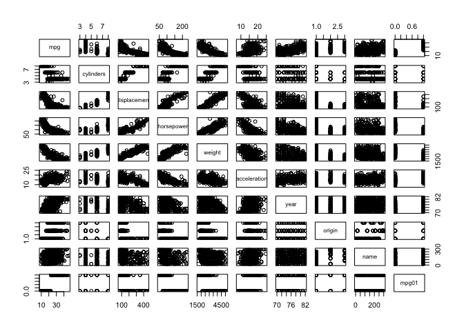

# Chapter4


**Chapter 4**

**6. Suppose we collect data for a group of students in a statistics class with variables X1 =hours studied, X2 =undergrad GPA, and Y = receive an A. We fit a logistic regression and produce estimated coefficient, ˆ β0 = −6, ˆβ1 = 0.05, ˆβ2 = 1.**

(a) Estimate the probability that a student who studies for 40 h and has an undergrad GPA of 3.5 gets an A in the class.


```r
(exp(-6+0.05*40+1*3.5))/(1+(exp(-6+0.05*40+1*3.5)))
```

```
## [1] 0.3775407
```

(b) How many hours would the student in part (a) need to study to have a 50% chance of getting an A in the class?


**10. This question should be answered using the Weekly data set, which is part of the ISLR package. This data is similar in nature to the Smarket data from this chapter’s lab, except that it contains 1, 089 weekly returns for 21 years, from the beginning of 1990 to the end of 2010.**

**(a) Produce some numerical and graphical summaries of the Weekly data. Do there appear to be any patterns?**

```r
library(ISLR)
Weekly <- Weekly
cor(Weekly[,-9])
```

```
##               Year         Lag1        Lag2        Lag3         Lag4
## Year    1.00000000 -0.032289274 -0.03339001 -0.03000649 -0.031127923
## Lag1   -0.03228927  1.000000000 -0.07485305  0.05863568 -0.071273876
## Lag2   -0.03339001 -0.074853051  1.00000000 -0.07572091  0.058381535
## Lag3   -0.03000649  0.058635682 -0.07572091  1.00000000 -0.075395865
## Lag4   -0.03112792 -0.071273876  0.05838153 -0.07539587  1.000000000
## Lag5   -0.03051910 -0.008183096 -0.07249948  0.06065717 -0.075675027
## Volume  0.84194162 -0.064951313 -0.08551314 -0.06928771 -0.061074617
## Today  -0.03245989 -0.075031842  0.05916672 -0.07124364 -0.007825873
##                Lag5      Volume        Today
## Year   -0.030519101  0.84194162 -0.032459894
## Lag1   -0.008183096 -0.06495131 -0.075031842
## Lag2   -0.072499482 -0.08551314  0.059166717
## Lag3    0.060657175 -0.06928771 -0.071243639
## Lag4   -0.075675027 -0.06107462 -0.007825873
## Lag5    1.000000000 -0.05851741  0.011012698
## Volume -0.058517414  1.00000000 -0.033077783
## Today   0.011012698 -0.03307778  1.000000000
```

```r
pairs(Weekly)
```

<!-- -->

The only real distinguishing trend is that volume has increased over time.

**(b) Use the full data set to perform a logistic regression with Direction as the response and the five lag variables plus Volume
as predictors. Use the summary function to print the results. Do any of the predictors appear to be statistically significant? If so, which ones?**


```r
weekly.glm1 <- glm(Direction ~ .-Today, data = Weekly, family = binomial)
summary(weekly.glm1)
```

```
## 
## Call:
## glm(formula = Direction ~ . - Today, family = binomial, data = Weekly)
## 
## Deviance Residuals: 
##     Min       1Q   Median       3Q      Max  
## -1.7071  -1.2578   0.9941   1.0873   1.4665  
## 
## Coefficients:
##              Estimate Std. Error z value Pr(>|z|)  
## (Intercept) 17.225822  37.890522   0.455   0.6494  
## Year        -0.008500   0.018991  -0.448   0.6545  
## Lag1        -0.040688   0.026447  -1.538   0.1239  
## Lag2         0.059449   0.026970   2.204   0.0275 *
## Lag3        -0.015478   0.026703  -0.580   0.5622  
## Lag4        -0.027316   0.026485  -1.031   0.3024  
## Lag5        -0.014022   0.026409  -0.531   0.5955  
## Volume       0.003256   0.068836   0.047   0.9623  
## ---
## Signif. codes:  0 '***' 0.001 '**' 0.01 '*' 0.05 '.' 0.1 ' ' 1
## 
## (Dispersion parameter for binomial family taken to be 1)
## 
##     Null deviance: 1496.2  on 1088  degrees of freedom
## Residual deviance: 1486.2  on 1081  degrees of freedom
## AIC: 1502.2
## 
## Number of Fisher Scoring iterations: 4
```

```r
contrasts(Weekly$Direction)
```

```
##      Up
## Down  0
## Up    1
```

Lag2 is slightly significant. It is positively associated with an increase in the probability of the market going up.

**(c) Compute the confusion matrix and overall fraction of correct predictions. Explain what the confusion matrix is telling you
about the types of mistakes made by logistic regression.**


```r
glm.probs=predict(weekly.glm1,type="response")
glm.pred=rep("Down",1089)
glm.pred[glm.probs>.5]="Up"
table(glm.pred,Weekly$Direction)
```

```
##         
## glm.pred Down  Up
##     Down   56  47
##     Up    428 558
```

```r
(558+56)/1089
```

```
## [1] 0.56382
```
I'm not totally clear on how to read this table. Does 458 mean that the model predicted that the market would go down 428 times when it actually went up, or the other way around?

**(d) Now fit the logistic regression model using a training data period from 1990 to 2008, with Lag2 as the only predictor. Compute the confusion matrix and the overall fraction of correct predictions for the held out data (that is, the data from 2009 and 2010).**


```r
library(tidyverse)
```

```
## Loading tidyverse: ggplot2
## Loading tidyverse: tibble
## Loading tidyverse: tidyr
## Loading tidyverse: readr
## Loading tidyverse: purrr
## Loading tidyverse: dplyr
```

```
## Conflicts with tidy packages ----------------------------------------------
```

```
## filter(): dplyr, stats
## lag():    dplyr, stats
```

```r
training <- filter(Weekly, Year < 2009)
test <- filter(Weekly, Year > 2008)
train.glm <- glm(Direction ~ Lag2, data = training, family = binomial)
summary(train.glm)
```

```
## 
## Call:
## glm(formula = Direction ~ Lag2, family = binomial, data = training)
## 
## Deviance Residuals: 
##    Min      1Q  Median      3Q     Max  
## -1.536  -1.264   1.021   1.091   1.368  
## 
## Coefficients:
##             Estimate Std. Error z value Pr(>|z|)   
## (Intercept)  0.20326    0.06428   3.162  0.00157 **
## Lag2         0.05810    0.02870   2.024  0.04298 * 
## ---
## Signif. codes:  0 '***' 0.001 '**' 0.01 '*' 0.05 '.' 0.1 ' ' 1
## 
## (Dispersion parameter for binomial family taken to be 1)
## 
##     Null deviance: 1354.7  on 984  degrees of freedom
## Residual deviance: 1350.5  on 983  degrees of freedom
## AIC: 1354.5
## 
## Number of Fisher Scoring iterations: 4
```

```r
glm.probs2 <- predict(train.glm,test,type="response")
glm.pred2 <- rep("Down",104)
glm.pred2[glm.probs2>.5]="Up"
table(glm.pred2,test$Direction)
```

```
##          
## glm.pred2 Down Up
##      Down    9  5
##      Up     34 56
```

```r
(9+56)/104
```

```
## [1] 0.625
```

**(e) Repeat (d) using LDA.**

```r
library(MASS)
```

```
## 
## Attaching package: 'MASS'
```

```
## The following object is masked from 'package:dplyr':
## 
##     select
```

```r
train.lda <- lda(Direction ~ Lag2, data = training)
train.lda
```

```
## Call:
## lda(Direction ~ Lag2, data = training)
## 
## Prior probabilities of groups:
##      Down        Up 
## 0.4477157 0.5522843 
## 
## Group means:
##             Lag2
## Down -0.03568254
## Up    0.26036581
## 
## Coefficients of linear discriminants:
##            LD1
## Lag2 0.4414162
```

```r
lda.pred <- predict(train.lda, test)
lda.class=lda.pred$class
table(lda.class,test$Direction)
```

```
##          
## lda.class Down Up
##      Down    9  5
##      Up     34 56
```

```r
(9+56)/104
```

```
## [1] 0.625
```

Exactly the same result as my logistic regraion above!

**11. In this problem, you will develop a model to predict whether a given car gets high or low gas mileage based on the Auto data set.**

**(a) Create a binary variable, mpg01, that contains a 1 if mpg contains a value above its median, and a 0 if mpg contains a value below its median. You can compute the median using the median() function. Note you may find it helpful to use the data.frame()
function to create a single data set containing both mpg01 and the other Auto variables.**


```r
auto <- Auto
median <- median(auto$mpg)
median
```

```
## [1] 22.75
```

```r
auto <- mutate(auto, mpg01 = ifelse(mpg > median,1,0))
```


**(b) Explore the data graphically in order to investigate the association between mpg01 and the other features. Which of the other
features seem most likely to be useful in predicting mpg01? Scatterplots and boxplots may be useful tools to answer this question.
Describe your findings.**


```r
pairs(auto)
```

<!-- -->

Obviously, mpg will be useful, but otherwise it looks like horsepower, weight, and acceleration should be helpful.

**(c) Split the data into a training set and a test set.**


```r
auto <- mutate(auto, rand = sample(1:392))
auto.train <- filter(auto, rand < 197)
auto.test <- filter(auto, rand > 196)
```

**(d) Perform LDA on the training data in order to predict mpg01 using the variables that seemed most associated with mpg01 in
(b). What is the test error of the model obtained?**


```r
auto.lda1 <- lda(mpg01 ~ mpg, data = auto.train)
auto.lda1
```

```
## Call:
## lda(mpg01 ~ mpg, data = auto.train)
## 
## Prior probabilities of groups:
##         0         1 
## 0.4591837 0.5408163 
## 
## Group means:
##        mpg
## 0 17.23222
## 1 30.13208
## 
## Coefficients of linear discriminants:
##           LD1
## mpg 0.2257402
```

```r
auto.lda.pred1 <- predict(auto.lda1, auto.test)
auto.lda1.class=auto.lda.pred1$class
table(auto.lda1.class,auto.test$mpg01)
```

```
##                
## auto.lda1.class   0   1
##               0 106   7
##               1   0  83
```

```r
(107+84)/196
```

```
## [1] 0.9744898
```

```r
auto.lda2 <- lda(mpg01 ~ horsepower + weight + acceleration, data = auto.train)
auto.lda2
```

```
## Call:
## lda(mpg01 ~ horsepower + weight + acceleration, data = auto.train)
## 
## Prior probabilities of groups:
##         0         1 
## 0.4591837 0.5408163 
## 
## Group means:
##   horsepower   weight acceleration
## 0  126.75556 3602.089     15.03778
## 1   78.16038 2277.311     16.26792
## 
## Coefficients of linear discriminants:
##                       LD1
## horsepower    0.001190949
## weight       -0.001926278
## acceleration -0.022892869
```

```r
auto.lda.pred2 <- predict(auto.lda2, auto.test)
auto.lda2.class=auto.lda.pred2$class
table(auto.lda2.class,auto.test$mpg01)
```

```
##                
## auto.lda2.class  0  1
##               0 85  8
##               1 21 82
```

```r
(78+89)/196
```

```
## [1] 0.8520408
```
LDA works with near-perfect predictors - the first model with mpg as predictor was 97% accurate. With horsepower, weight, and acceleration LDA was 85% accurate - slightly better than logistic regression with the same predictors.

**(f) Perform logistic regression on the training data in order to predict mpg01 using the variables that seemed most associated with mpg01 in (b). What is the test error of the model obtained?**


```r
#auto.glm <- glm(mpg01 ~ mpg + horsepower + weight + acceleration, data = auto.train, family = binomial)
#summary(auto.glm)

auto.glm2 <- glm(mpg01 ~ horsepower + weight + acceleration, data = auto.train, family = binomial)
summary(auto.glm2)
```

```
## 
## Call:
## glm(formula = mpg01 ~ horsepower + weight + acceleration, family = binomial, 
##     data = auto.train)
## 
## Deviance Residuals: 
##     Min       1Q   Median       3Q      Max  
## -2.2715  -0.1661   0.1009   0.3082   2.7706  
## 
## Coefficients:
##                Estimate Std. Error z value Pr(>|z|)    
## (Intercept)  17.0418657  4.1593058   4.097 4.18e-05 ***
## horsepower   -0.0603903  0.0302816  -1.994 0.046121 *  
## weight       -0.0032836  0.0008721  -3.765 0.000166 ***
## acceleration -0.1202993  0.1730982  -0.695 0.487070    
## ---
## Signif. codes:  0 '***' 0.001 '**' 0.01 '*' 0.05 '.' 0.1 ' ' 1
## 
## (Dispersion parameter for binomial family taken to be 1)
## 
##     Null deviance: 270.406  on 195  degrees of freedom
## Residual deviance:  97.385  on 192  degrees of freedom
## AIC: 105.39
## 
## Number of Fisher Scoring iterations: 7
```

```r
auto.probs <- predict(auto.glm2,auto.test,type="response")
auto.pred <- rep(0,196)
auto.pred[auto.probs>.5]=1
table(auto.pred,auto.test$mpg01)
```

```
##          
## auto.pred  0  1
##         0 93 12
##         1 13 78
```

```r
1-(75+91)/196
```

```
## [1] 0.1530612
```
An assumption of logistic regression is that none of the predictors are perfect, so mpg needs to be excluded. With the three selected variables, we get a 15.3% error rate.
