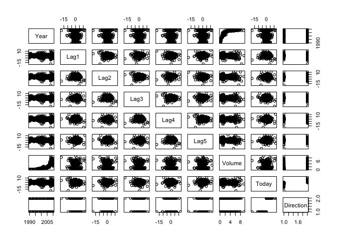

# Chapter4


**Chapter 4**

**5. We now examine the differences between LDA and QDA.**

**(a) If the Bayes decision boundary is linear, do we expect LDA or QDA to perform better on the training set? On the test set?**

They should be similar on the training set, but LDA should perform better on the test set because it has less variance.

**(b) If the Bayes decision boundary is non-linear, do we expect LDA or QDA to perform better on the training set? On the test set?**

QDA should do better on both, as it will better model the non-linear boundary for the training set and will have less bias on the test.

**(c) In general, as the sample size n increases, do we expect the test prediction accuracy of QDA relative to LDA to improve, decline, or be unchanged? Why?**

As the sample size goes up, the relative prediction accuracy of QDA should go up, as the variance will decrease.

**(d) True or False: Even if the Bayes decision boundary for a given problem is linear, we will probably achieve a superior test error rate using QDA rather than LDA because QDA is flexible enough to model a linear decision boundary. Justify your answer.**

False, because QDA could overfit the data and have high variance, particualrly with small sample sizes.

**6. Suppose we collect data for a group of students in a statistics class with variables X1 =hours studied, X2 =undergrad GPA, and Y = receive an A. We fit a logistic regression and produce estimated coefficient, ˆ β0 = −6, ˆβ1 = 0.05, ˆβ2 = 1.**

(a) Estimate the probability that a student who studies for 40 h and has an undergrad GPA of 3.5 gets an A in the class.


```r
(exp(-6+0.05*40+1*3.5))/(1+(exp(-6+0.05*40+1*3.5)))
```

```
## [1] 0.3775407
```

(b) How many hours would the student in part (a) need to study to have a 50% chance of getting an A in the class?


**8. Suppose that we take a data set, divide it into equally-sized training and test sets, and then try out two different classification procedures. First we use logistic regression and get an error rate of 20% on the training data and 30% on the test data. Next we use 1-nearest neighbors (i.e. K = 1) and get an average error rate (averaged over both test and training data sets) of 18 %. Based on these results, which method should we prefer to use for classification of new observations? Why?**

This is a trick question. The training error rate for k=1 is always 0, because you only look at one point, so that means the test error is 36%. Therefore logistic regression is preferred.

**9. This problem has to do with odds.**
**(a) On average, what fraction of people with an odds of 0.37 of defaulting on their credit card payment will in fact default?**
(x)/1-x = .37   x = .37 - .37x  1.37x = .37   x = .37/1.37

```r
.37/1.37
```

```
## [1] 0.270073
```


**(b) Suppose that an individual has a 16% chance of defaulting on her credit card payment. What are the odds that she will default?**


```r
.16/(1-.16)
```

```
## [1] 0.1904762
```


**10. This question should be answered using the Weekly data set, which is part of the ISLR package. This data is similar in nature to the Smarket data from this chapter’s lab, except that it contains 1, 089 weekly returns for 21 years, from the beginning of 1990 to the end of 2010.**

**(a) Produce some numerical and graphical summaries of the Weekly data. Do there appear to be any patterns?**

```r
library(ISLR)
Weekly <- Weekly
cor(Weekly[,-9])
```

```
##               Year         Lag1        Lag2        Lag3         Lag4
## Year    1.00000000 -0.032289274 -0.03339001 -0.03000649 -0.031127923
## Lag1   -0.03228927  1.000000000 -0.07485305  0.05863568 -0.071273876
## Lag2   -0.03339001 -0.074853051  1.00000000 -0.07572091  0.058381535
## Lag3   -0.03000649  0.058635682 -0.07572091  1.00000000 -0.075395865
## Lag4   -0.03112792 -0.071273876  0.05838153 -0.07539587  1.000000000
## Lag5   -0.03051910 -0.008183096 -0.07249948  0.06065717 -0.075675027
## Volume  0.84194162 -0.064951313 -0.08551314 -0.06928771 -0.061074617
## Today  -0.03245989 -0.075031842  0.05916672 -0.07124364 -0.007825873
##                Lag5      Volume        Today
## Year   -0.030519101  0.84194162 -0.032459894
## Lag1   -0.008183096 -0.06495131 -0.075031842
## Lag2   -0.072499482 -0.08551314  0.059166717
## Lag3    0.060657175 -0.06928771 -0.071243639
## Lag4   -0.075675027 -0.06107462 -0.007825873
## Lag5    1.000000000 -0.05851741  0.011012698
## Volume -0.058517414  1.00000000 -0.033077783
## Today   0.011012698 -0.03307778  1.000000000
```

```r
pairs(Weekly)
```

<!-- -->

The only real distinguishing trend is that volume has increased over time.

**(b) Use the full data set to perform a logistic regression with Direction as the response and the five lag variables plus Volume
as predictors. Use the summary function to print the results. Do any of the predictors appear to be statistically significant? If so, which ones?**


```r
weekly.glm1 <- glm(Direction ~ .-Today, data = Weekly, family = binomial)
summary(weekly.glm1)
```

```
## 
## Call:
## glm(formula = Direction ~ . - Today, family = binomial, data = Weekly)
## 
## Deviance Residuals: 
##     Min       1Q   Median       3Q      Max  
## -1.7071  -1.2578   0.9941   1.0873   1.4665  
## 
## Coefficients:
##              Estimate Std. Error z value Pr(>|z|)  
## (Intercept) 17.225822  37.890522   0.455   0.6494  
## Year        -0.008500   0.018991  -0.448   0.6545  
## Lag1        -0.040688   0.026447  -1.538   0.1239  
## Lag2         0.059449   0.026970   2.204   0.0275 *
## Lag3        -0.015478   0.026703  -0.580   0.5622  
## Lag4        -0.027316   0.026485  -1.031   0.3024  
## Lag5        -0.014022   0.026409  -0.531   0.5955  
## Volume       0.003256   0.068836   0.047   0.9623  
## ---
## Signif. codes:  0 '***' 0.001 '**' 0.01 '*' 0.05 '.' 0.1 ' ' 1
## 
## (Dispersion parameter for binomial family taken to be 1)
## 
##     Null deviance: 1496.2  on 1088  degrees of freedom
## Residual deviance: 1486.2  on 1081  degrees of freedom
## AIC: 1502.2
## 
## Number of Fisher Scoring iterations: 4
```

```r
contrasts(Weekly$Direction)
```

```
##      Up
## Down  0
## Up    1
```

Lag2 is slightly significant. It is positively associated with an increase in the probability of the market going up.

**(c) Compute the confusion matrix and overall fraction of correct predictions. Explain what the confusion matrix is telling you
about the types of mistakes made by logistic regression.**


```r
glm.probs=predict(weekly.glm1,type="response")
glm.pred=rep("Down",1089)
glm.pred[glm.probs>.5]="Up"
table(glm.pred,Weekly$Direction)
```

```
##         
## glm.pred Down  Up
##     Down   56  47
##     Up    428 558
```

```r
(558+56)/1089
```

```
## [1] 0.56382
```
I'm not totally clear on how to read this table. Does 458 mean that the model predicted that the market would go down 428 times when it actually went up, or the other way around?

**(d) Now fit the logistic regression model using a training data period from 1990 to 2008, with Lag2 as the only predictor. Compute the confusion matrix and the overall fraction of correct predictions for the held out data (that is, the data from 2009 and 2010).**


```r
library(tidyverse)
```

```
## Loading tidyverse: ggplot2
## Loading tidyverse: tibble
## Loading tidyverse: tidyr
## Loading tidyverse: readr
## Loading tidyverse: purrr
## Loading tidyverse: dplyr
```

```
## Conflicts with tidy packages ----------------------------------------------
```

```
## filter(): dplyr, stats
## lag():    dplyr, stats
```

```r
training <- filter(Weekly, Year < 2009)
test <- filter(Weekly, Year > 2008)
train.glm <- glm(Direction ~ Lag2, data = training, family = binomial)
summary(train.glm)
```

```
## 
## Call:
## glm(formula = Direction ~ Lag2, family = binomial, data = training)
## 
## Deviance Residuals: 
##    Min      1Q  Median      3Q     Max  
## -1.536  -1.264   1.021   1.091   1.368  
## 
## Coefficients:
##             Estimate Std. Error z value Pr(>|z|)   
## (Intercept)  0.20326    0.06428   3.162  0.00157 **
## Lag2         0.05810    0.02870   2.024  0.04298 * 
## ---
## Signif. codes:  0 '***' 0.001 '**' 0.01 '*' 0.05 '.' 0.1 ' ' 1
## 
## (Dispersion parameter for binomial family taken to be 1)
## 
##     Null deviance: 1354.7  on 984  degrees of freedom
## Residual deviance: 1350.5  on 983  degrees of freedom
## AIC: 1354.5
## 
## Number of Fisher Scoring iterations: 4
```

```r
glm.probs2 <- predict(train.glm,test,type="response")
glm.pred2 <- rep("Down",104)
glm.pred2[glm.probs2>.5]="Up"
table(glm.pred2,test$Direction)
```

```
##          
## glm.pred2 Down Up
##      Down    9  5
##      Up     34 56
```

```r
(9+56)/104
```

```
## [1] 0.625
```

**(e) Repeat (d) using LDA.**

```r
library(MASS)
```

```
## 
## Attaching package: 'MASS'
```

```
## The following object is masked from 'package:dplyr':
## 
##     select
```

```r
train.lda <- lda(Direction ~ Lag2, data = training)
train.lda
```

```
## Call:
## lda(Direction ~ Lag2, data = training)
## 
## Prior probabilities of groups:
##      Down        Up 
## 0.4477157 0.5522843 
## 
## Group means:
##             Lag2
## Down -0.03568254
## Up    0.26036581
## 
## Coefficients of linear discriminants:
##            LD1
## Lag2 0.4414162
```

```r
lda.pred <- predict(train.lda, test)
lda.class=lda.pred$class
table(lda.class,test$Direction)
```

```
##          
## lda.class Down Up
##      Down    9  5
##      Up     34 56
```

```r
(9+56)/104
```

```
## [1] 0.625
```

Exactly the same result as my logistic regraion above!

**(f) Repeat (d) using QDA.**


```r
library(MASS)
train.qda <- qda(Direction ~ Lag2, data = training)
train.qda
```

```
## Call:
## qda(Direction ~ Lag2, data = training)
## 
## Prior probabilities of groups:
##      Down        Up 
## 0.4477157 0.5522843 
## 
## Group means:
##             Lag2
## Down -0.03568254
## Up    0.26036581
```

```r
qda.pred <- predict(train.qda, test)
qda.class=qda.pred$class
table(qda.class,test$Direction)
```

```
##          
## qda.class Down Up
##      Down    0  0
##      Up     43 61
```

```r
(61)/104
```

```
## [1] 0.5865385
```
58% accuracy - better than LDA. However, it seems to have done it by always predicting up.

**(g) Repeat (d) using KNN with K = 1.**

```r
train.lag2.scaled <- scale(select(training, Lag2))
```

```
## Error in select(training, Lag2): unused argument (Lag2)
```

```r
test.lag2.scaled <- scale(select(test, Lag2))
```

```
## Error in select(test, Lag2): unused argument (Lag2)
```

```r
train.y <- training$Direction
test.y <- test$Direction
set.seed(1)
library(class)
knn.pred1 <- knn(train.lag2.scaled, test.lag2.scaled, train.y, k=1)
```

```
## Error in as.matrix(train): object 'train.lag2.scaled' not found
```

```r
table(knn.pred1,test.y)
```

```
## Error in table(knn.pred1, test.y): object 'knn.pred1' not found
```

```r
(15+36)/104
```

```
## [1] 0.4903846
```
49% accuracy!

**(h) Which of these methods appears to provide the best results on this data?**

Logistic regression and LDA were best.

**(i) Experiment with different combinations of predictors, including possible transformations and interactions, for each of the
methods. Report the variables, method, and associated confusion matrix that appears to provide the best results on the held
out data. Note that you should also experiment with values for K in the KNN classifier.**

KNN with all variables as predictors:

```r
train.scaled <- scale(select(training, -Direction, -Today))
```

```
## Error in select(training, -Direction, -Today): unused arguments (-Direction, -Today)
```

```r
test.scaled <- scale(select(test, -Direction, -Today))
```

```
## Error in select(test, -Direction, -Today): unused arguments (-Direction, -Today)
```

```r
train.y <- training$Direction
test.y <- test$Direction
set.seed(1)
library(class)
knn.pred1 <- knn(train.scaled, test.scaled, train.y, k=1)
```

```
## Error in as.matrix(train): object 'train.scaled' not found
```

```r
table(knn.pred1,test.y)
```

```
## Error in table(knn.pred1, test.y): object 'knn.pred1' not found
```

```r
(18+39)/104
```

```
## [1] 0.5480769
```
54.8% accuracy! This increases to 78% when Today is added (which drives direction)


```r
train.lda2 <- lda(Direction ~ Lag2 + poly(Lag2, 4), data = training)
```

```
## Warning in lda.default(x, grouping, ...): variables are collinear
```

```r
train.lda2
```

```
## Call:
## lda(Direction ~ Lag2 + poly(Lag2, 4), data = training)
## 
## Prior probabilities of groups:
##      Down        Up 
## 0.4477157 0.5522843 
## 
## Group means:
##             Lag2 poly(Lag2, 4)1 poly(Lag2, 4)2 poly(Lag2, 4)3
## Down -0.03568254   -0.002297100  -0.0011282685  -0.0008460402
## Up    0.26036581    0.001862171   0.0009146441   0.0006858524
##      poly(Lag2, 4)4
## Down    0.001971281
## Up     -0.001598042
## 
## Coefficients of linear discriminants:
##                        LD1
## Lag2             0.1521805
## poly(Lag2, 4)1  10.8318942
## poly(Lag2, 4)2  10.6406187
## poly(Lag2, 4)3   7.9789444
## poly(Lag2, 4)4 -18.5910093
```

```r
lda.pred2 <- predict(train.lda2, test)
lda.class2=lda.pred2$class
table(lda.class2,test$Direction)
```

```
##           
## lda.class2 Down Up
##       Down    0  0
##       Up     43 61
```
Now exactly the same as QDA - makes given that we've added polynomial terms.

**11. In this problem, you will develop a model to predict whether a given car gets high or low gas mileage based on the Auto data set.**

**(a) Create a binary variable, mpg01, that contains a 1 if mpg contains a value above its median, and a 0 if mpg contains a value below its median. You can compute the median using the median() function. Note you may find it helpful to use the data.frame()
function to create a single data set containing both mpg01 and the other Auto variables.**


```r
auto <- Auto
median <- median(auto$mpg)
median
```

```
## [1] 22.75
```

```r
auto <- mutate(auto, mpg01 = ifelse(mpg > median,1,0))
```


**(b) Explore the data graphically in order to investigate the association between mpg01 and the other features. Which of the other
features seem most likely to be useful in predicting mpg01? Scatterplots and boxplots may be useful tools to answer this question.
Describe your findings.**


```r
pairs(auto)
```

<!-- -->

Obviously, mpg will be useful, but otherwise it looks like horsepower, weight, and acceleration should be helpful.

**(c) Split the data into a training set and a test set.**


```r
auto <- mutate(auto, rand = sample(1:392))
auto.train <- filter(auto, rand < 197)
auto.test <- filter(auto, rand > 196)
```

**(d) Perform LDA on the training data in order to predict mpg01 using the variables that seemed most associated with mpg01 in
(b). What is the test error of the model obtained?**


```r
auto.lda1 <- lda(mpg01 ~ mpg, data = auto.train)
auto.lda1
```

```
## Call:
## lda(mpg01 ~ mpg, data = auto.train)
## 
## Prior probabilities of groups:
##         0         1 
## 0.4540816 0.5459184 
## 
## Group means:
##        mpg
## 0 16.75618
## 1 30.09720
## 
## Coefficients of linear discriminants:
##           LD1
## mpg 0.2359928
```

```r
auto.lda.pred1 <- predict(auto.lda1, auto.test)
auto.lda1.class=auto.lda.pred1$class
table(auto.lda1.class,auto.test$mpg01)
```

```
##                
## auto.lda1.class   0   1
##               0 107   5
##               1   0  84
```

```r
(107+84)/196
```

```
## [1] 0.9744898
```

```r
auto.lda2 <- lda(mpg01 ~ horsepower + weight + acceleration, data = auto.train)
auto.lda2
```

```
## Call:
## lda(mpg01 ~ horsepower + weight + acceleration, data = auto.train)
## 
## Prior probabilities of groups:
##         0         1 
## 0.4540816 0.5459184 
## 
## Group means:
##   horsepower   weight acceleration
## 0  132.56180 3653.618     14.26292
## 1   78.34579 2320.019     16.45701
## 
## Coefficients of linear discriminants:
##                       LD1
## horsepower   -0.005727568
## weight       -0.001566224
## acceleration  0.035453812
```

```r
auto.lda.pred2 <- predict(auto.lda2, auto.test)
auto.lda2.class=auto.lda.pred2$class
table(auto.lda2.class,auto.test$mpg01)
```

```
##                
## auto.lda2.class  0  1
##               0 84  2
##               1 23 87
```

```r
(78+89)/196
```

```
## [1] 0.8520408
```
LDA works with near-perfect predictors - the first model with mpg as predictor was 97% accurate. With horsepower, weight, and acceleration LDA was 85% accurate - slightly better than logistic regression with the same predictors.

**(e) Perform QDA on the training data in order to predict mpg01 using the variables that seemed most associated with mpg01 in
(b). What is the test error of the model obtained?**


```r
auto.qda <- qda(mpg01 ~ horsepower + weight + acceleration, data = auto.train)
auto.qda
```

```
## Call:
## qda(mpg01 ~ horsepower + weight + acceleration, data = auto.train)
## 
## Prior probabilities of groups:
##         0         1 
## 0.4540816 0.5459184 
## 
## Group means:
##   horsepower   weight acceleration
## 0  132.56180 3653.618     14.26292
## 1   78.34579 2320.019     16.45701
```

```r
auto.qda.pred <- predict(auto.qda, auto.test)
auto.qda.class=auto.qda.pred$class
table(auto.qda.class,auto.test$mpg01)
```

```
##               
## auto.qda.class  0  1
##              0 86  2
##              1 21 87
```

```r
(77+91)/196
```

```
## [1] 0.8571429
```
85.7% test accuracy rate - slightly better than LDA.

**(f) Perform logistic regression on the training data in order to predict mpg01 using the variables that seemed most associated with mpg01 in (b). What is the test error of the model obtained?**


```r
#auto.glm <- glm(mpg01 ~ mpg + horsepower + weight + acceleration, data = auto.train, family = binomial)
#summary(auto.glm)

auto.glm2 <- glm(mpg01 ~ horsepower + weight + acceleration, data = auto.train, family = binomial)
summary(auto.glm2)
```

```
## 
## Call:
## glm(formula = mpg01 ~ horsepower + weight + acceleration, family = binomial, 
##     data = auto.train)
## 
## Deviance Residuals: 
##      Min        1Q    Median        3Q       Max  
## -2.21139  -0.07478   0.09156   0.30284   2.54316  
## 
## Coefficients:
##               Estimate Std. Error z value Pr(>|z|)    
## (Intercept)  15.955706   4.071483   3.919  8.9e-05 ***
## horsepower   -0.068870   0.028361  -2.428 0.015169 *  
## weight       -0.003027   0.000905  -3.345 0.000823 ***
## acceleration -0.033785   0.169261  -0.200 0.841790    
## ---
## Signif. codes:  0 '***' 0.001 '**' 0.01 '*' 0.05 '.' 0.1 ' ' 1
## 
## (Dispersion parameter for binomial family taken to be 1)
## 
##     Null deviance: 270.058  on 195  degrees of freedom
## Residual deviance:  94.196  on 192  degrees of freedom
## AIC: 102.2
## 
## Number of Fisher Scoring iterations: 7
```

```r
auto.probs <- predict(auto.glm2,auto.test,type="response")
auto.pred <- rep(0,196)
auto.pred[auto.probs>.5]=1
table(auto.pred,auto.test$mpg01)
```

```
##          
## auto.pred  0  1
##         0 89  7
##         1 18 82
```

```r
1-(75+91)/196
```

```
## [1] 0.1530612
```
An assumption of logistic regression is that none of the predictors are perfect, so mpg needs to be excluded. With the three selected variables, we get a 15.3% error rate.

**(g) Perform KNN on the training data, with several values of K, in order to predict mpg01. Use only the variables that seemed most associated with mpg01 in (b). What test errors do you obtain? Which value of K seems to perform the best on this data set?**


```r
auto.train.scaled <- scale(select(auto.train, horsepower, weight, acceleration))
```

```
## Error in select(auto.train, horsepower, weight, acceleration): unused arguments (horsepower, weight, acceleration)
```

```r
auto.test.scaled <- scale(select(auto.test, horsepower, weight, acceleration))
```

```
## Error in select(auto.test, horsepower, weight, acceleration): unused arguments (horsepower, weight, acceleration)
```

```r
auto.train.y <- auto.train$mpg01
auto.test.y <- auto.test$mpg01
set.seed(1)
knn.pred1 <- knn(auto.train.scaled, auto.test.scaled, auto.train.y, k=1)
```

```
## Error in as.matrix(train): object 'auto.train.scaled' not found
```

```r
table(knn.pred1,auto.test.y)
```

```
## Error in table(knn.pred1, auto.test.y): object 'knn.pred1' not found
```

```r
1-((83+79)/196)
```

```
## [1] 0.1734694
```
17.3% test error for k=1


```r
auto.train.scaled <- scale(select(auto.train, horsepower, weight, acceleration))
```

```
## Error in select(auto.train, horsepower, weight, acceleration): unused arguments (horsepower, weight, acceleration)
```

```r
auto.test.scaled <- scale(select(auto.test, horsepower, weight, acceleration))
```

```
## Error in select(auto.test, horsepower, weight, acceleration): unused arguments (horsepower, weight, acceleration)
```

```r
auto.train.y <- auto.train$mpg01
auto.test.y <- auto.test$mpg01
set.seed(1)
knn.pred1 <- knn(auto.train.scaled, auto.test.scaled, auto.train.y, k=2)
```

```
## Error in as.matrix(train): object 'auto.train.scaled' not found
```

```r
table(knn.pred1,auto.test.y)
```

```
## Error in table(knn.pred1, auto.test.y): object 'knn.pred1' not found
```

```r
1-((85+76)/196)
```

```
## [1] 0.1785714
```
17.9% test error for k=2


```r
auto.train.scaled <- scale(select(auto.train, horsepower, weight, acceleration))
```

```
## Error in select(auto.train, horsepower, weight, acceleration): unused arguments (horsepower, weight, acceleration)
```

```r
auto.test.scaled <- scale(select(auto.test, horsepower, weight, acceleration))
```

```
## Error in select(auto.test, horsepower, weight, acceleration): unused arguments (horsepower, weight, acceleration)
```

```r
auto.train.y <- auto.train$mpg01
auto.test.y <- auto.test$mpg01
set.seed(1)
knn.pred1 <- knn(auto.train.scaled, auto.test.scaled, auto.train.y, k=3)
```

```
## Error in as.matrix(train): object 'auto.train.scaled' not found
```

```r
table(knn.pred1,auto.test.y)
```

```
## Error in table(knn.pred1, auto.test.y): object 'knn.pred1' not found
```

```r
1-((89+83)/196)
```

```
## [1] 0.122449
```
12.2% test error for k=3


```r
auto.train.scaled <- scale(select(auto.train, horsepower, weight, acceleration))
```

```
## Error in select(auto.train, horsepower, weight, acceleration): unused arguments (horsepower, weight, acceleration)
```

```r
auto.test.scaled <- scale(select(auto.test, horsepower, weight, acceleration))
```

```
## Error in select(auto.test, horsepower, weight, acceleration): unused arguments (horsepower, weight, acceleration)
```

```r
auto.train.y <- auto.train$mpg01
auto.test.y <- auto.test$mpg01
set.seed(1)
knn.pred1 <- knn(auto.train.scaled, auto.test.scaled, auto.train.y, k=4)
```

```
## Error in as.matrix(train): object 'auto.train.scaled' not found
```

```r
table(knn.pred1,auto.test.y)
```

```
## Error in table(knn.pred1, auto.test.y): object 'knn.pred1' not found
```

```r
1-((87+83)/196)
```

```
## [1] 0.1326531
```
13.2% test error for k=4

**13. Using the Boston data set, fit classification models in order to predict whether a given suburb has a crime rate above or below the median. Explore logistic regression, LDA, and KNN models using various subsets of the predictors. Describe your findings.**

Generate a new variable, "crime," to hold whether the data is above or below the median.

```r
boston <- Boston
boston <- mutate(boston, crime = ifelse(crim > median(crim),1,0))
```

Create test and training sets using a random number generator.

```r
boston <- mutate(boston, rand = sample(1:506))
boston.train <- filter(boston, rand < 380)
boston.test <- filter(boston, rand > 379)
```


Logistic regression using zn, indus, dis, and black as predictors. Raw generated an error and medv wasn't significant, so it was dropped.

```r
boston.glm1 <- glm(crime ~ zn + indus + dis + black, data = boston.train, family = binomial)
summary(boston.glm1)
```

```
## 
## Call:
## glm(formula = crime ~ zn + indus + dis + black, family = binomial, 
##     data = boston.train)
## 
## Deviance Residuals: 
##      Min        1Q    Median        3Q       Max  
## -2.89905  -0.62435  -0.04365   0.60769   2.97667  
## 
## Coefficients:
##              Estimate Std. Error z value Pr(>|z|)    
## (Intercept)  6.081309   2.140603   2.841  0.00450 ** 
## zn          -0.025088   0.014822  -1.693  0.09052 .  
## indus        0.076613   0.028392   2.698  0.00697 ** 
## dis         -0.617617   0.124513  -4.960 7.04e-07 ***
## black       -0.012335   0.005265  -2.343  0.01913 *  
## ---
## Signif. codes:  0 '***' 0.001 '**' 0.01 '*' 0.05 '.' 0.1 ' ' 1
## 
## (Dispersion parameter for binomial family taken to be 1)
## 
##     Null deviance: 525.34  on 378  degrees of freedom
## Residual deviance: 306.65  on 374  degrees of freedom
## AIC: 316.65
## 
## Number of Fisher Scoring iterations: 7
```

```r
boston.glm.probs1 <- predict(boston.glm1,boston.test,type="response")
boston.pred1 <- rep(0,127)
boston.pred1[boston.glm.probs1>.5]=1
table(boston.pred1,boston.test$crime)
```

```
##             
## boston.pred1  0  1
##            0 52 16
##            1  9 50
```

```r
1-(44+55)/127
```

```
## [1] 0.2204724
```
22% error rate for logistic regression.

LDA using the same predictors:

```r
boston.lda1 <- lda(crime ~ zn + indus + dis + black, data = boston.train)
boston.lda1
```

```
## Call:
## lda(crime ~ zn + indus + dis + black, data = boston.train)
## 
## Prior probabilities of groups:
##         0         1 
## 0.5065963 0.4934037 
## 
## Group means:
##          zn     indus      dis    black
## 0 20.778646  7.103698 5.115574 388.2181
## 1  1.304813 15.322941 2.495096 321.5521
## 
## Coefficients of linear discriminants:
##                 LD1
## zn     2.914518e-05
## indus  9.010556e-02
## dis   -3.229196e-01
## black -3.048644e-03
```

```r
boston.lda.pred <- predict(boston.lda1, boston.test)
boston.lda.class = boston.lda.pred$class
table(boston.lda.class,boston.test$crime)
```

```
##                 
## boston.lda.class  0  1
##                0 55 19
##                1  6 47
```

```r
1-(47+49)/127
```

```
## [1] 0.2440945
```
24.4% error rate for LDA.

QDA using the same predictors:

```r
boston.qda1 <- qda(crime ~ zn + indus + dis + black, data = boston.train)
boston.qda1
```

```
## Call:
## qda(crime ~ zn + indus + dis + black, data = boston.train)
## 
## Prior probabilities of groups:
##         0         1 
## 0.5065963 0.4934037 
## 
## Group means:
##          zn     indus      dis    black
## 0 20.778646  7.103698 5.115574 388.2181
## 1  1.304813 15.322941 2.495096 321.5521
```

```r
boston.qda.pred <- predict(boston.qda1, boston.test)
boston.qda.class = boston.qda.pred$class
table(boston.qda.class,boston.test$crime)
```

```
##                 
## boston.qda.class  0  1
##                0 54 14
##                1  7 52
```

```r
1-(47+53)/127
```

```
## [1] 0.2125984
```
21.2% error rate for QDA.

Getting errors with the intial select commands:

```r
#boston.train.scaled <- scale(select(boston.train, zn, idus, dis, black))
#boston.test.scaled <- scale(dplyr::select(boston.test, zn, idus, dis, black))
#boston.train.y <- boston.train$crime
#boston.test.y <- boston.test$crime
#set.seed(1)
#knn4.boston.pred <- knn(boston.train.scaled, boston.test.scaled, boston.train.y, k=4)
#table(knn4.boston.pred,boston.test.y)
```
13.2% test error for k=4
