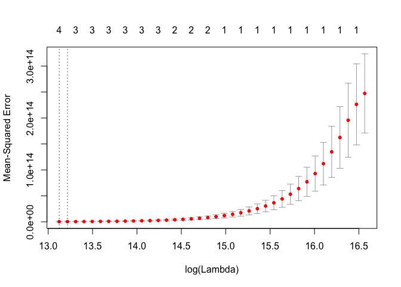

# Chapter6


**1. We perform best subset, forward stepwise, and backward stepwise selection on a single data set. For each approach, we obtain p + 1 models, containing 0, 1, 2, . . . , p predictors. Explain your answers:**

(a) Which of the three models with k predictors has the smallest training RSS?

Depending on the step, all three will be equal, or best subset will have the smallest RSS. Best subset selection should find the best model for each given k. Depending on the starting points, forward and reverse selection will find the best models for at least some of the models.

(b) Which of the three models with k predictors has the smallest test RSS?

That we can't really say with testing using cross validation.

(c) True or False:
i. The predictors in the k-variable model identified by forward stepwise are a subset of the predictors in the (k+1)-variable
model identified by forward stepwise selection.

True. The forward stepwise approach would ID the best model with k predictors and then pick the best predictor to add to those k predictors.

ii. The predictors in the k-variable model identified by backward stepwise are a subset of the predictors in the (k + 1)-
variable model identified by backward stepwise selection.

True. As with forward selection, the model selection in backwards stepwise is sequential, so the starting points for finding the best model with k predictors is the model with k+1 predictors.

iii. The predictors in the k-variable model identified by backward stepwise are a subset of the predictors in the (k + 1)-
variable model identified by forward stepwise selection.

False. This could potentially happen, but it isn't assured.

iv. The predictors in the k-variable model identified by forward stepwise are a subset of the predictors in the (k+1)-variable
model identified by backward stepwise selection.

False. This could potentially happen, but it isn't assured.

v. The predictors in the k-variable model identified by best subset are a subset of the predictors in the (k + 1)-variable
model identified by best subset selection.

False. This could happen, but the best subset for k + 1 could potentially drop one or more of the predictors used in the model with k predictors.

**2. For parts (a) through (c), indicate which of i. through iv. is correct. Justify your answer.**
(a) The lasso, relative to least squares, is:
i. More flexible and hence will give improved prediction accuracy when its increase in bias is less than its decrease in
variance.
ii. More flexible and hence will give improved prediction accuracy when its increase in variance is less than its decrease
in bias.
iii. Less flexible and hence will give improved prediction accuracy when its increase in bias is less than its decrease in
variance.
iv. Less flexible and hence will give improved prediction accuracy when its increase in variance is less than its decrease
in bias.

Option iii is true. It is less flexible because you can't incorporate as many terms into your model. This should reduce error due to overfitting (variance), but could limit your ability to properly model the data (bias).

(b) Repeat (a) for ridge regression relative to least squares.

Same answer as for the lasso.

(c) Repeat (a) for non-linear methods relative to least squares.

Choice ii is true. This is bacause non-linear methods are more flexible by being able to fit more complex models to the data. This will be better in situations where the underlying function is complex (meaning that least squares will have higher bias).

**8. In this exercise, we will generate simulated data, and will then use this data to perform best subset selection.**

(a) Use the rnorm() function to generate a predictor X of length n = 100, as well as a noise vector ϵ of length n = 100.


```r
set.seed(1)
x <- rnorm(100, 10, 1)
e <- rnorm(100, 1, .1)
```


(b) Generate a response vector Y of length n = 100 according to the model Y = β0 + β1X + β2X2 + β3X3 + ϵ, where β0, β1, β2, and β3 are constants of your choice.


```r
B0 <- 5
B1 <- 6
B2 <- 7
B3 <- 8
y <- B0 + B1*x + B2*(x^2) + B3*(x^3) + e
```


(c) Use the regsubsets() function to perform best subset selection in order to choose the best model containing the predictors
X,X2, . . .,X10. What is the best model obtained according to Cp, BIC, and adjusted R2? Show some plots to provide evidence
for your answer, and report the coefficients of the best model obtained. Note you will need to use the data.frame() function to
create a single data set containing both X and Y .


```r
library(leaps)
data <- data.frame(x, y)
data.best <- regsubsets(y ~ poly(x, 10, raw=T), data = data, nvmax = 10)
```

```
## Warning in leaps.setup(x, y, wt = wt, nbest = nbest, nvmax = nvmax,
## force.in = force.in, : 1 linear dependencies found
```

```
## Warning in leaps.setup(x, y, wt = wt, nbest = nbest, nvmax = nvmax,
## force.in = force.in, : nvmax reduced to 9
```

```r
summary(data.best)
```

```
## Subset selection object
## Call: regsubsets.formula(y ~ poly(x, 10, raw = T), data = data, nvmax = 10)
## 10 Variables  (and intercept)
##                        Forced in Forced out
## poly(x, 10, raw = T)1      FALSE      FALSE
## poly(x, 10, raw = T)2      FALSE      FALSE
## poly(x, 10, raw = T)3      FALSE      FALSE
## poly(x, 10, raw = T)4      FALSE      FALSE
## poly(x, 10, raw = T)5      FALSE      FALSE
## poly(x, 10, raw = T)6      FALSE      FALSE
## poly(x, 10, raw = T)7      FALSE      FALSE
## poly(x, 10, raw = T)8      FALSE      FALSE
## poly(x, 10, raw = T)9      FALSE      FALSE
## poly(x, 10, raw = T)10     FALSE      FALSE
## 1 subsets of each size up to 9
## Selection Algorithm: exhaustive
##          poly(x, 10, raw = T)1 poly(x, 10, raw = T)2 poly(x, 10, raw = T)3
## 1  ( 1 ) " "                   " "                   "*"                  
## 2  ( 1 ) " "                   "*"                   "*"                  
## 3  ( 1 ) " "                   "*"                   "*"                  
## 4  ( 1 ) "*"                   " "                   "*"                  
## 5  ( 1 ) " "                   "*"                   " "                  
## 6  ( 1 ) " "                   " "                   " "                  
## 7  ( 1 ) "*"                   " "                   " "                  
## 8  ( 1 ) " "                   "*"                   " "                  
## 9  ( 1 ) "*"                   "*"                   "*"                  
##          poly(x, 10, raw = T)4 poly(x, 10, raw = T)5 poly(x, 10, raw = T)6
## 1  ( 1 ) " "                   " "                   " "                  
## 2  ( 1 ) " "                   " "                   " "                  
## 3  ( 1 ) " "                   " "                   " "                  
## 4  ( 1 ) " "                   " "                   " "                  
## 5  ( 1 ) "*"                   "*"                   "*"                  
## 6  ( 1 ) "*"                   "*"                   " "                  
## 7  ( 1 ) " "                   "*"                   "*"                  
## 8  ( 1 ) "*"                   "*"                   "*"                  
## 9  ( 1 ) "*"                   "*"                   "*"                  
##          poly(x, 10, raw = T)7 poly(x, 10, raw = T)8 poly(x, 10, raw = T)9
## 1  ( 1 ) " "                   " "                   " "                  
## 2  ( 1 ) " "                   " "                   " "                  
## 3  ( 1 ) " "                   " "                   " "                  
## 4  ( 1 ) " "                   "*"                   " "                  
## 5  ( 1 ) "*"                   " "                   " "                  
## 6  ( 1 ) "*"                   "*"                   "*"                  
## 7  ( 1 ) "*"                   "*"                   "*"                  
## 8  ( 1 ) "*"                   "*"                   "*"                  
## 9  ( 1 ) "*"                   "*"                   "*"                  
##          poly(x, 10, raw = T)10
## 1  ( 1 ) " "                   
## 2  ( 1 ) " "                   
## 3  ( 1 ) "*"                   
## 4  ( 1 ) "*"                   
## 5  ( 1 ) " "                   
## 6  ( 1 ) "*"                   
## 7  ( 1 ) "*"                   
## 8  ( 1 ) "*"                   
## 9  ( 1 ) " "
```

```r
best.summary <- summary(data.best)
plot(data.best, scale="Cp")
```

<!-- -->

```r
which.min(best.summary$Cp)
```

```
## integer(0)
```

```r
plot(data.best, scale="bic")
```

<!-- -->

```r
plot(best.summary$bic,xlab="Number of Variables",ylab="BIC")
```

<!-- -->

```r
which.min(best.summary$bic)
```

```
## [1] 3
```

```r
plot(data.best, scale="adjr2")
```

<!-- -->

```r
which.max(best.summary$adjr2)
```

```
## [1] 4
```

```r
coef(data.best,3)
```

```
##            (Intercept)  poly(x, 10, raw = T)2  poly(x, 10, raw = T)3 
##           2.294530e+01           7.706716e+00           7.972183e+00 
## poly(x, 10, raw = T)10 
##           2.126691e-11
```
Cp seems to favor a model with no predictors? BIC favors 3 predictors, while adjr2 favors 4. I'm not clear on how to read the plots.

Check with manually generated exponents:

```r
data2 <- read.csv("data.csv",header=TRUE)
data2.best <- regsubsets(y ~ ., data = data2, nvmax=10)
summary(data2.best)
```

```
## Subset selection object
## Call: regsubsets.formula(y ~ ., data = data2, nvmax = 10)
## 11 Variables  (and intercept)
##     Forced in Forced out
## X       FALSE      FALSE
## x       FALSE      FALSE
## x2      FALSE      FALSE
## x3      FALSE      FALSE
## x4      FALSE      FALSE
## x5      FALSE      FALSE
## x6      FALSE      FALSE
## x7      FALSE      FALSE
## x8      FALSE      FALSE
## x9      FALSE      FALSE
## x10     FALSE      FALSE
## 1 subsets of each size up to 10
## Selection Algorithm: exhaustive
##           X   x   x2  x3  x4  x5  x6  x7  x8  x9  x10
## 1  ( 1 )  " " " " " " "*" " " " " " " " " " " " " " "
## 2  ( 1 )  " " " " "*" "*" " " " " " " " " " " " " " "
## 3  ( 1 )  " " " " "*" "*" " " " " " " " " " " " " "*"
## 4  ( 1 )  " " "*" " " "*" " " " " " " " " "*" " " "*"
## 5  ( 1 )  "*" "*" " " "*" " " " " " " " " "*" " " "*"
## 6  ( 1 )  " " " " " " " " "*" "*" " " "*" "*" "*" "*"
## 7  ( 1 )  "*" " " " " " " "*" "*" " " "*" "*" "*" "*"
## 8  ( 1 )  "*" "*" " " " " "*" " " "*" "*" "*" "*" "*"
## 9  ( 1 )  " " "*" "*" "*" "*" " " "*" "*" "*" "*" "*"
## 10  ( 1 ) "*" "*" "*" "*" "*" " " "*" "*" "*" "*" "*"
```

```r
data2.best.summary <- summary(data2.best)
which.min(data2.best.summary$bic)
```

```
## [1] 3
```

```r
plot(data2.best, scale="bic")
```

<!-- -->

```r
which.max(data2.best.summary$adjr2)
```

```
## [1] 4
```
Same results, so the poly code seems to work.

(d) Repeat (c), using forward stepwise selection and also using backwards stepwise selection. How does your answer compare to the
results in (c)?

```r
data.forward <- regsubsets(y ~ poly(x, 10, raw=T), data = data, nvmax = 10, method = "forward")
```

```
## Warning in leaps.setup(x, y, wt = wt, nbest = nbest, nvmax = nvmax,
## force.in = force.in, : 1 linear dependencies found
```

```
## Warning in leaps.setup(x, y, wt = wt, nbest = nbest, nvmax = nvmax,
## force.in = force.in, : nvmax reduced to 9
```

```
## Warning in rval$lopt[] <- rval$vorder[rval$lopt]: number of items to
## replace is not a multiple of replacement length
```

```r
summary(data.forward)
```

```
## Subset selection object
## Call: regsubsets.formula(y ~ poly(x, 10, raw = T), data = data, nvmax = 10, 
##     method = "forward")
## 10 Variables  (and intercept)
##                        Forced in Forced out
## poly(x, 10, raw = T)1      FALSE      FALSE
## poly(x, 10, raw = T)2      FALSE      FALSE
## poly(x, 10, raw = T)3      FALSE      FALSE
## poly(x, 10, raw = T)4      FALSE      FALSE
## poly(x, 10, raw = T)5      FALSE      FALSE
## poly(x, 10, raw = T)6      FALSE      FALSE
## poly(x, 10, raw = T)7      FALSE      FALSE
## poly(x, 10, raw = T)8      FALSE      FALSE
## poly(x, 10, raw = T)9      FALSE      FALSE
## poly(x, 10, raw = T)10     FALSE      FALSE
## 1 subsets of each size up to 9
## Selection Algorithm: forward
##          poly(x, 10, raw = T)1 poly(x, 10, raw = T)2 poly(x, 10, raw = T)3
## 1  ( 1 ) " "                   " "                   "*"                  
## 2  ( 1 ) " "                   "*"                   "*"                  
## 3  ( 1 ) " "                   "*"                   "*"                  
## 4  ( 1 ) " "                   "*"                   "*"                  
## 5  ( 1 ) "*"                   "*"                   "*"                  
## 6  ( 1 ) "*"                   "*"                   "*"                  
## 7  ( 1 ) "*"                   "*"                   "*"                  
## 8  ( 1 ) "*"                   "*"                   "*"                  
## 9  ( 1 ) "*"                   "*"                   "*"                  
##          poly(x, 10, raw = T)4 poly(x, 10, raw = T)5 poly(x, 10, raw = T)6
## 1  ( 1 ) " "                   " "                   " "                  
## 2  ( 1 ) " "                   " "                   " "                  
## 3  ( 1 ) " "                   " "                   " "                  
## 4  ( 1 ) " "                   " "                   " "                  
## 5  ( 1 ) " "                   " "                   " "                  
## 6  ( 1 ) " "                   " "                   " "                  
## 7  ( 1 ) " "                   " "                   " "                  
## 8  ( 1 ) "*"                   " "                   " "                  
## 9  ( 1 ) "*"                   "*"                   " "                  
##          poly(x, 10, raw = T)7 poly(x, 10, raw = T)8 poly(x, 10, raw = T)9
## 1  ( 1 ) " "                   " "                   " "                  
## 2  ( 1 ) " "                   " "                   " "                  
## 3  ( 1 ) " "                   " "                   " "                  
## 4  ( 1 ) " "                   " "                   "*"                  
## 5  ( 1 ) " "                   " "                   "*"                  
## 6  ( 1 ) " "                   "*"                   "*"                  
## 7  ( 1 ) "*"                   "*"                   "*"                  
## 8  ( 1 ) "*"                   "*"                   "*"                  
## 9  ( 1 ) "*"                   "*"                   "*"                  
##          poly(x, 10, raw = T)10
## 1  ( 1 ) " "                   
## 2  ( 1 ) " "                   
## 3  ( 1 ) "*"                   
## 4  ( 1 ) "*"                   
## 5  ( 1 ) "*"                   
## 6  ( 1 ) "*"                   
## 7  ( 1 ) "*"                   
## 8  ( 1 ) "*"                   
## 9  ( 1 ) "*"
```

```r
forward.summary <- summary(data.forward)
plot(data.forward, scale="Cp")
```

<!-- -->

```r
which.min(forward.summary$Cp)
```

```
## integer(0)
```

```r
plot(data.forward, scale="bic")
```

<!-- -->

```r
plot(forward.summary$bic,xlab="Number of Variables",ylab="BIC")
```

<!-- -->

```r
which.min(forward.summary$bic)
```

```
## [1] 3
```

```r
plot(data.forward, scale="adjr2")
```

<!-- -->

```r
which.max(forward.summary$adjr2)
```

```
## [1] 5
```

```r
coef(data.forward,3)
```

```
##            (Intercept)  poly(x, 10, raw = T)2  poly(x, 10, raw = T)3 
##           2.294530e+01           7.706716e+00           7.972183e+00 
## poly(x, 10, raw = T)10 
##           2.126691e-11
```
Same result for BIC, but it went with 5 or adjr2.

(e) Now fit a lasso model to the simulated data, again using X,X2, . . . , X10 as predictors. Use cross-validation to select the optimal value of λ. Create plots of the cross-validation error as a function of λ. Report the resulting coefficient estimates, and discuss the results obtained.


```r
library(glmnet)
```

```
## Loading required package: Matrix
```

```
## Loading required package: foreach
```

```
## Loaded glmnet 2.0-13
```

```r
x <- model.matrix(y ~ ., data = data2)
y <- data2$y
fit.lasso <- glmnet(x,y)
plot(fit.lasso,xvar = "lambda", label = TRUE)
```

<!-- -->

```r
cv.lasso <- cv.glmnet(x,y)
plot(cv.lasso)
```

<!-- -->

```r
coef(cv.lasso)
```

```
## 13 x 1 sparse Matrix of class "dgCMatrix"
##                        1
## (Intercept) 1.426996e+02
## (Intercept) .           
## X           .           
## x           .           
## x2          1.384629e+01
## x3          7.214695e+00
## x4          4.489594e-03
## x5          .           
## x6          .           
## x7          .           
## x8          .           
## x9          .           
## x10         .
```
It looks like the optimal log lamba is around 4.4 (how do I find the exact value?), which uses 3 terms from the model.

(f) Now generate a response vector Y according to the model Y = β0 + β7X7 + ϵ, and perform best subset selection and the lasso. Discuss the results obtained.

set up the data:

```r
set.seed(1)
p <- rnorm(100, 10, 1)
e <- rnorm(100, 1, .1)
B0 <- 5
B7 <- 2
r <- B0 + B7*(p^7) + e
data3 <- data.frame(p, r)
```

lasso:

```r
x1 <- model.matrix(r ~ poly(p,10,raw=T), data = data3)
y1 <- data3$r
fit.lasso <- glmnet(x1,y1)
plot(fit.lasso,xvar = "lambda", label = TRUE)
```

<!-- -->

```r
cv.lasso <- cv.glmnet(x1,y1)
plot(cv.lasso)
```

<!-- -->

```r
coef(cv.lasso)
```

```
## 12 x 1 sparse Matrix of class "dgCMatrix"
##                                   1
## (Intercept)            6.496776e+05
## (Intercept)            .           
## poly(p, 10, raw = T)1  .           
## poly(p, 10, raw = T)2  .           
## poly(p, 10, raw = T)3  .           
## poly(p, 10, raw = T)4  .           
## poly(p, 10, raw = T)5  .           
## poly(p, 10, raw = T)6  1.484908e+00
## poly(p, 10, raw = T)7  1.789259e+00
## poly(p, 10, raw = T)8  1.748603e-03
## poly(p, 10, raw = T)9  .           
## poly(p, 10, raw = T)10 .
```
This favors a three term model, which includes X7, so that's good.

**9. In this exercise, we will predict the number of applications received using the other variables in the College data set.**

(a) Split the data set into a training set and a test set.

```r
library(ISLR)
college <- College
library(caTools)
college$set <- sample.split(college$Private, SplitRatio = .75)
college.test <- subset(college, set == "FALSE")
college.train <- subset(college, set == "TRUE")
```

(d) Fit a lasso model on the training set, with λ chosen by crossvalidation. Report the test error obtained, along with the number
of non-zero coefficient estimates.


```r
x2 <- model.matrix(Apps ~ ., data = college.train)
x2.test <- model.matrix(Apps ~ ., data = college.test)
y2 <- college.train$Apps
fit.lasso3 <- glmnet(x2,y2)
plot(fit.lasso3,xvar = "lambda", label = TRUE)
```

<!-- -->

```r
cv.lasso3 <- cv.glmnet(x2,y2)
plot(cv.lasso3)
```

<!-- -->

```r
coef(cv.lasso3)
```

```
## 20 x 1 sparse Matrix of class "dgCMatrix"
##                       1
## (Intercept) -424.595878
## (Intercept)    .       
## PrivateYes     .       
## Accept         1.383285
## Enroll         .       
## Top10perc     23.799222
## Top25perc      .       
## F.Undergrad    .       
## P.Undergrad    .       
## Outstate       .       
## Room.Board     .       
## Books          .       
## Personal       .       
## PhD            .       
## Terminal       .       
## S.F.Ratio      .       
## perc.alumni    .       
## Expend         .       
## Grad.Rate      .       
## setTRUE        .
```

```r
lambda <- cv.lasso3$lambda.min
lambda
```

```
## [1] 3.301919
```

```r
lasso.pred = predict(cv.lasso3, newx = x2.test, s=lambda)
mean((college.test[, "Apps"] - lasso.pred)^2)
```

```
## [1] 1226248
```

11. We will now try to predict per capita crime rate in the Boston data set.

(a) Try out some of the regression methods explored in this chapter, such as best subset selection, the lasso, ridge regression, and PCR. Present and discuss results for the approaches that you consider.

Set up test and training sets:

```r
library(MASS)
boston <- Boston
boston$set <- sample.split(boston$crim, SplitRatio = .75)
boston.test <- subset(boston, set == "FALSE")
boston.train <- subset(boston, set == "TRUE")
```

lasso:

```r
x5 <- model.matrix(crim ~ ., data = boston.train)
x5.test <- model.matrix(crim ~ ., data = boston.test)
y5 <- boston.train$crim
fit.lasso5 <- glmnet(x5,y5)
plot(fit.lasso5,xvar = "lambda", label = TRUE)
```

<!-- -->

```r
cv.lasso5 <- cv.glmnet(x5,y5)
plot(cv.lasso5)
```

<!-- -->

```r
coef(cv.lasso5)
```

```
## 16 x 1 sparse Matrix of class "dgCMatrix"
##                     1
## (Intercept) 1.9190892
## (Intercept) .        
## zn          .        
## indus       .        
## chas        .        
## nox         .        
## rm          .        
## age         .        
## dis         .        
## rad         0.1969097
## tax         .        
## ptratio     .        
## black       .        
## lstat       .        
## medv        .        
## setTRUE     .
```

```r
lambda4 <- cv.lasso4$lambda.min
```

```
## Error in eval(expr, envir, enclos): object 'cv.lasso4' not found
```

```r
lambda4
```

```
## Error in eval(expr, envir, enclos): object 'lambda4' not found
```

```r
lasso.pred4 = predict(cv.lasso4, newx = x4.test, s=lambda4)
```

```
## Error in predict(cv.lasso4, newx = x4.test, s = lambda4): object 'cv.lasso4' not found
```

```r
mean((boston.test[, "crim"] - lasso.pred4)^2)
```

```
## Error in mean((boston.test[, "crim"] - lasso.pred4)^2): object 'lasso.pred4' not found
```

lasso:

```r
x4 <- model.matrix(crim ~ ., data = boston.train)
x4.test <- model.matrix(crim ~ ., data = boston.test)
y4 <- boston.train$crim
fit.lasso4 <- glmnet(x4,y4)
plot(fit.lasso4,xvar = "lambda", label = TRUE)
```

<!-- -->

```r
cv.lasso4 <- cv.glmnet(x4,y4)
plot(cv.lasso4)
```

<!-- -->

```r
coef(cv.lasso4)
```

```
## 16 x 1 sparse Matrix of class "dgCMatrix"
##                     1
## (Intercept) 1.9190892
## (Intercept) .        
## zn          .        
## indus       .        
## chas        .        
## nox         .        
## rm          .        
## age         .        
## dis         .        
## rad         0.1969097
## tax         .        
## ptratio     .        
## black       .        
## lstat       .        
## medv        .        
## setTRUE     .
```

```r
lambda4 <- cv.lasso4$lambda.min
lambda4
```

```
## [1] 0.07037899
```

```r
lasso.pred4 = predict(cv.lasso4, newx = x4.test, s=lambda4)
mean((boston.test[, "crim"] - lasso.pred4)^2)
```

```
## [1] 21.88484
```
